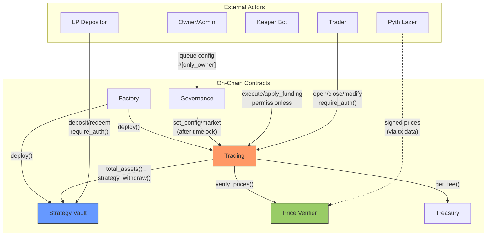
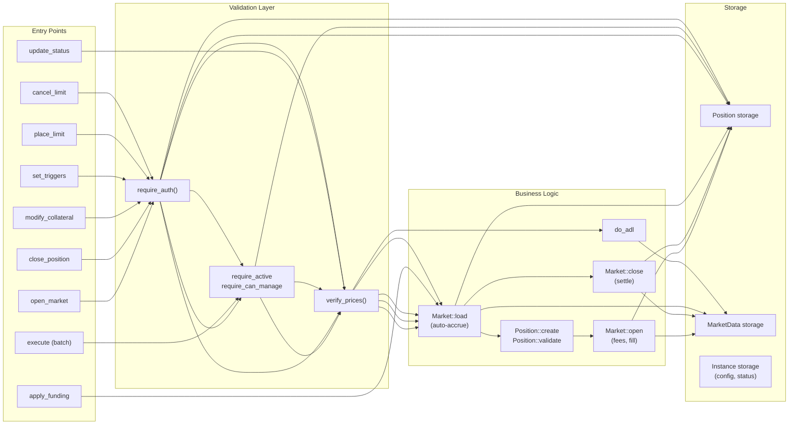
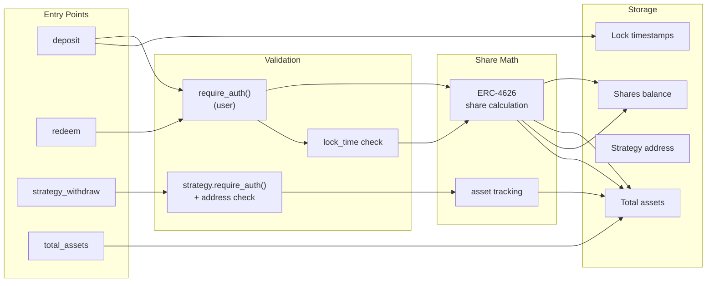
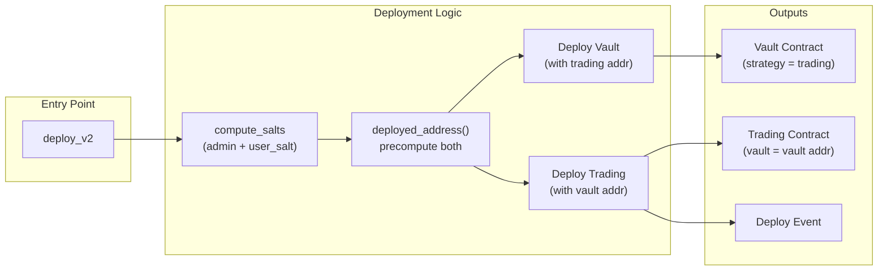
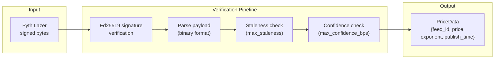

# Zenex Perpetual Futures Protocol -- STRIDE Threat Model

This document follows Stellar's four-section threat modeling framework to comprehensively identify, categorize, and address threats to the Zenex perpetual futures protocol on Soroban. The four sections correspond to the four questions: (1) What are we working on? (2) What can go wrong? (3) What are we going to do about it? (4) Did we do a good job?

**Scope:** On-chain smart contracts only. Off-chain services (keeper, relayer, backend, frontend) are modeled only at their trust boundaries with contracts.

**Contracts in scope:** Trading, Strategy Vault, Factory, Price Verifier

**Contracts out of scope:** Treasury (referenced as an external trust boundary), Account (separate repository)

---

## 1. What Are We Working On?

### 1.1 System Description

Zenex is a decentralized perpetual futures trading protocol on the Stellar blockchain (Soroban). Traders open leveraged long and short positions on price feeds (e.g., BTC/USD), backed by a shared liquidity vault that serves as the counterparty. The protocol uses a single collateral token per pool, a single oracle provider (Pyth Lazer), and all settlement happens on-chain with no off-chain matching engine.

**Core contracts:**

- **Trading** -- The primary contract managing positions, fees, funding, borrowing, and settlement. It is the main attack surface with 5 of 7 trust boundaries. Entry points include user position management (open, close, modify, triggers), keeper batch execution (fills, liquidations, stop-loss, take-profit), permissionless operations (funding accrual, status updates), and admin configuration.

- **Strategy Vault** -- An ERC-4626 compliant tokenized vault holding all collateral. LPs deposit the collateral token and receive vault shares. The trading contract (registered as the single strategy) can withdraw to settle profitable positions. Shares are subject to a configurable lock period after deposit.

- **Factory** -- Deploys trading+vault pairs atomically using deterministic address precomputation (`deployed_address()`) to resolve the circular dependency: vault needs the trading address, trading needs the vault address. The factory stores compiled WASM hashes and the treasury address at construction.

- **Price Verifier** -- Verifies Pyth Lazer signed price updates via Ed25519 signature verification, staleness checks, and confidence interval validation. Returns `PriceData` (feed_id, price, exponent, publish_time) used by the trading contract to derive `price_scalar = 10^(-exponent)` for fixed-point math.

**Key design patterns:**

- **Fixed-point math:** SCALAR_7 (10^7) for rates, fees, and ratios; SCALAR_18 (10^18) for cumulative indices (funding, borrowing, ADL). The `soroban-fixed-point-math` crate provides `fixed_mul_ceil/floor` and `fixed_div_ceil/floor` operations.
- **Index-based fee accrual:** MarketData stores cumulative funding, borrowing, and ADL indices. Positions snapshot these indices at fill time. Settlement computes accrued fees as `notional * (current_idx - snapshot_idx)`.
- **Factory deployment:** Precomputes both vault and trading addresses, deploys vault first (with trading address), then trading (with vault address). Admin address is mixed into salt derivation to prevent front-running.
- **Constructor pattern:** All contracts use `__constructor` (no separate `initialize` calls), making initialization atomic with deployment.

### 1.2 System-Level Data Flow Diagram

**Diagram notes:**
- Solid arrows represent authenticated calls (require_auth() or #[only_owner])
- Dashed arrows represent data-only flows (signed price bytes passed through transaction data)
- Trading (orange) is highlighted as the primary attack surface
- Treasury is included as an external boundary; it is out of audit scope but its trust relationship with Trading is modeled

### 1.3 Trading Contract Data Flow

**Key flows:**
- All user operations require `require_auth()` on the position owner
- `open_market` and `place_limit` require Active status; other operations require Not Frozen
- `Market::load` automatically accrues funding and borrowing indices to current timestamp
- `execute` processes a batch of Fill/StopLoss/TakeProfit/Liquidate requests sequentially
- `apply_funding` is hourly-gated and updates all market indices
- `update_status` evaluates net PnL across all markets for ADL circuit breaker

### 1.4 Vault Contract Data Flow

**Key flows:**
- Deposits mint shares via ERC-4626 math and record the deposit timestamp for lock enforcement
- Redemptions check lock period before allowing share burns
- `strategy_withdraw` is restricted to the registered strategy address (trading contract) via both `require_auth()` and stored address comparison
- `total_assets` is a read-only query used by the trading contract for utilization calculations
- `decimals_offset` parameter mitigates ERC-4626 vault inflation attacks

### 1.5 Factory Contract Data Flow

**Key flows:**
- `compute_salts` mixes the admin address into the deterministic salt, preventing front-running by other deployers
- `deployed_address()` precomputes both contract addresses before any deployment, resolving the circular dependency
- Vault is deployed first (it does not call trading at construction), then trading (which stores the vault address)
- The factory's treasury address (from `init_meta`) is passed to the trading constructor -- the deployer has no control over which treasury is used
- `is_deployed()` marks factory-deployed pools for verification

### 1.6 Price Verifier Data Flow

**Key flows:**
- Raw bytes enter from the transaction data (submitted by keeper or user)
- Ed25519 signature is verified against the stored `trusted_signer` public key using `env.crypto().ed25519_verify()`
- Binary payload is parsed according to Pyth Lazer format (magic bytes, version, feed data)
- Staleness check rejects prices where `publish_time < ledger_timestamp - max_staleness`
- Confidence check rejects prices where `confidence * 10000 > price * max_confidence_bps`
- Output PriceData is used by trading to derive `price_scalar = 10^(-exponent)` for fixed-point math
- All three threshold parameters (`trusted_signer`, `max_staleness`, `max_confidence_bps`) are owner-configurable via `#[only_owner]` functions

### 1.7 Asset Inventory

#### Financial Assets

| Asset | Type | Location | Risk if Compromised |
|-------|------|----------|---------------------|
| Collateral token balances | Fungible token | Strategy Vault (`total_assets`) | Total loss of LP-deposited liquidity backing all positions |
| Collateral held by trading | Fungible token | Trading contract token balance | Loss of unfilled limit order deposits and in-transit settlement amounts |
| Vault share tokens | Fungible token (ERC-4626) | Strategy Vault | LP ownership claims manipulated; vault drainage via share inflation |
| Protocol fee revenue | Fungible token | Treasury contract | Loss of accumulated protocol fees (bounded; no user collateral) |
| Position collateral | Per-position state | Trading: `Position.col` | Individual trader collateral stolen or misdirected |
| Trader PnL claims | Calculated at settlement | Trading contract | Fabricated profits drain vault; suppressed profits steal from traders |

#### Stateful Assets

| Asset | Type | Location | Risk if Compromised |
|-------|------|----------|---------------------|
| Open positions | Persistent storage | Trading: `Position(u32)` | Positions manipulated, deleted, or fabricated |
| Market data (indices) | Persistent storage | Trading: `MarketData(u32)` | Corrupted indices cause incorrect fee/PnL calculations for all users |
| Market configs | Persistent storage | Trading: `MarketConfig(u32)` | Exploitative parameters (zero margin, extreme fees) |
| Trading config | Instance storage | Trading contract | Global parameter manipulation affecting all markets |
| Contract status | Instance storage | Trading contract | Unauthorized freeze traps all funds; unauthorized unfreeze during crisis |
| Queued governance updates | Temporary storage | Governance contract | Stale or malicious config changes applied after timelock |
| Trusted signer pubkey | Instance storage | Price Verifier | Oracle takeover enables arbitrary price manipulation |
| Oracle thresholds | Instance storage | Price Verifier | Relaxed thresholds accept stale or low-confidence prices |
| Treasury fee rate | Instance storage | Treasury | Rate manipulation diverts fees (capped at 50%) |
| Factory init meta | Instance storage | Factory | WASM hashes determine deployed code; treasury address determines fee destination |
| Deployed pool registry | Persistent storage | Factory | False entries create phishing pools that appear factory-verified |
| Deposit lock timestamps | Persistent storage | Strategy Vault | Bypassed lock enables flash-loan style vault manipulation |

#### Privileged Credentials

| Credential | Holder | Powers | Risk if Compromised |
|------------|--------|--------|---------------------|
| Trading contract owner key | Set at construction (ideally governance) | set_config, set_market, set_status, upgrade | Total control over trading parameters and code |
| Price Verifier owner key | Set at construction | update_trusted_signer, update_max_confidence_bps, update_max_staleness | Can swap oracle signer, enabling price fabrication |
| Treasury owner key | Set at construction | set_rate, withdraw | Can drain accumulated fees and set exploitative rates |
| Governance owner key | Set at construction | queue/cancel config updates, set_status (immediate), upgrade | Can freeze/unfreeze trading, queue malicious config changes |
| Pyth Lazer trusted signer | Off-chain key stored in Price Verifier | All price data must be signed by this key | Compromise enables arbitrary price manipulation across all markets |
| Factory deployer | Any address calling `deploy()` with auth | Deploy new trading+vault pairs; deployer becomes trading owner | Can create pools with exploitative configs that appear factory-verified |

### 1.8 Actor Inventory

| Actor | Auth Method | Capabilities | Trust Level |
|-------|------------|--------------|-------------|
| Trader | `user.require_auth()` via Soroban signature verification | open_market, place_limit, close_position, cancel_limit, modify_collateral, set_triggers | Untrusted -- may attempt adversarial parameter choices |
| Keeper Bot | Permissionless (no require_auth on `execute`) | execute (batch Fill/SL/TP/Liquidate), apply_funding, update_status | Untrusted -- economically motivated, may be selective or manipulative |
| LP Depositor | `require_auth()` via OpenZeppelin vault implementation | deposit, mint, redeem, withdraw, transfer (after lock) | Untrusted -- accepts counterparty risk; may attempt vault manipulation |
| Owner/Admin | `#[only_owner]` macro (require_auth + ownership check) | set_config, set_market, set_status, upgrade, treasury set_rate/withdraw, price-verifier signer/thresholds | Trusted -- config changes timelocked via governance; status changes immediate (emergency) |
| Pyth Lazer Oracle | Ed25519 signature verification on-chain | Provides signed price data for all trading operations | Semi-trusted -- external dependency; key compromise is a known risk |
| Factory Deployer | `admin.require_auth()` on deploy() | Deploy new trading+vault pairs; deployer becomes pool owner | Trusted at deploy time -- permissionless deployment; frontend curates displayed pools |

### 1.9 Trust Boundaries

#### TB1: Trader -> Trading Contract

**What trader sends:**
- `open_market(user, feed_id, collateral, notional, is_long, tp, sl, price)` -- opens a leveraged position
- `close_position(user, position_id, price)` -- closes an existing position at current price
- `modify_collateral(user, position_id, amount, price)` -- adds or removes collateral from a position
- `set_triggers(user, position_id, tp, sl)` -- sets stop-loss and take-profit trigger prices
- `place_limit(user, feed_id, collateral, notional, is_long, tp, sl, entry_price)` -- creates a pending limit order
- `cancel_limit(user, position_id)` -- cancels an unfilled limit order
- All calls include `user.require_auth()` for Soroban signature verification

**What could go wrong in transit:**
- Transaction replay: prevented by Soroban's built-in nonce mechanism
- Front-running: possible via Stellar fee bumping -- attacker sees pending open_market and front-runs with own position to move the price. Mitigated by oracle price being verified (not affected by on-chain ordering) and by the impact fee mechanism
- Stale price submission: user submits an old signed price hoping for favorable entry -- rejected by staleness check in price verifier

**If trader is malicious:**
- Self-harm only: traders can only affect their own positions (require_auth enforces position ownership)
- Exception: large positions can trigger ADL on other users via `update_status` -- this is by design (ADL protects the vault)
- Adversarial parameters: extreme leverage, minimum collateral, maximum notional -- all bounded by config validation (margin requirement, notional bounds, utilization caps)
- Smart contract users: Soroban's `require_auth()` can be satisfied by contracts implementing `__check_auth()` with auto-approve patterns, enabling automated trading bots as position owners. This is by design.

**If trader is unavailable:**
- No impact on protocol -- the trader simply does not trade
- Open positions continue accruing fees (funding, borrowing) -- if a position becomes under-collateralized, keepers will liquidate it
- Unfilled limit orders remain pending until cancelled or filled

**Contract verification:**
- `require_auth()` on user address for all position operations
- Position ownership check from storage for subsequent operations (close, modify, cancel, triggers) -- the caller cannot substitute a different owner address
- Config validation: notional in [min, max], leverage <= 1/init_margin, TP > entry (longs) or TP < entry (shorts)
- Status guards: require_active for opens, require_can_manage for modifications

**Trust assumptions:**
- Trader's private key is not compromised
- Trader understands the risk of on-chain position transparency (positions, SL/TP, limit orders are publicly visible)

---

#### TB2: Keeper -> Trading Contract

**What keeper sends:**
- `execute(caller: Address, requests: Vec<ExecuteRequest>, price: Bytes)` -- batch of Fill/StopLoss/TakeProfit/Liquidate actions
- `caller` = fee destination address (not authenticated via require_auth)
- `requests` = ordered batch of position actions with trigger conditions
- `price` = Pyth Lazer signed price blob for verification
- `apply_funding()` -- triggers hourly funding and borrowing index accrual across all markets
- `update_status(price: Bytes)` -- evaluates net PnL for ADL circuit breaker

**What could go wrong in transit:**
- Price data could be stale (within max_staleness but significantly different from current market)
- Price data could be for the wrong feed_id (verified by price verifier against requested feeds)
- Batch could contain conflicting requests (fill + liquidate same position in one batch)

**If keeper is malicious:**
- Selective liquidation: ignores some eligible positions to protect allies -- mitigated by permissionless access (anyone can be a keeper)
- Timing manipulation: waits for favorable price before submitting liquidation -- limited by keeper competition and price staleness window
- Batch ordering: sequences requests to change market state mid-batch (e.g., large fill before marginal liquidation) -- each request validated against its own conditions
- Fee routing: sets `caller` to any address (low impact -- fees flow TO the address, not FROM it)

**If keeper is unavailable:**
- Liquidations do not execute -- under-collateralized positions bleed the vault
- SL/TP orders do not trigger -- users miss their protection levels
- Limit orders do not fill -- users miss entry opportunities
- `apply_funding` not called -- rate indices become stale (but accrue correctly on next interaction via Market::load auto-accrue)

**Contract verification:**
- Each request type has its own trigger condition verified against the verified price
- `require_can_manage()` -- status must not be Frozen
- Price verified via PriceVerifier cross-contract call (signature, staleness, confidence)
- No caller authentication on execute (permissionless by design)

**Trust assumptions:**
- At least one keeper is economically motivated to liquidate (caller fee incentive)
- Keepers submit reasonably fresh prices (within max_staleness)
- Keeper liveness is an operational concern, not a contract guarantee

---

#### TB3: Trading -> Price Verifier

**What trading sends:**
- `verify_prices(update_data: Bytes)` -- cross-contract call passing raw Pyth Lazer signed bytes
- Called during: open_market, close_position, execute (all types), update_status, modify_collateral

**What could go wrong in transit:**
- None -- this is an intra-Soroban cross-contract call. Execution is atomic within the same transaction. Data cannot be modified between the Trading and Price Verifier contracts.

**If price verifier is malicious (compromised contract or signer):**
- Returns fabricated prices -- enables arbitrary PnL manipulation, vault drainage
- Returns wrong exponents -- causes price_scalar miscalculation, affecting all position math
- Returns stale timestamps that pass validation -- positions opened/closed at outdated prices
- Accepts signatures from unauthorized keys -- any attacker can fabricate price data

**If price verifier is unavailable:**
- `verify_prices()` panics -- the calling transaction reverts entirely
- All position operations requiring price verification are blocked (open, close, execute, update_status, modify_collateral)
- Only price-independent operations work: place_limit, cancel_limit, set_triggers, apply_funding, admin functions

**Contract verification:**
- Ed25519 signature verification against stored `trusted_signer` public key
- Staleness check: `publish_time >= ledger_timestamp - max_staleness`
- Confidence check: `confidence * 10000 <= price * max_confidence_bps`
- Feed ID matching against requested feeds

**Trust assumptions:**
- The Ed25519 trusted signer key (Pyth Lazer) is not compromised
- Pyth Lazer service is available and producing timely, accurate prices
- The price verifier contract code is correct (deployed via factory with audited WASM hash)

---

#### TB4: Trading -> Vault (Strategy Vault)

**What trading sends:**
- `strategy_withdraw(strategy: Address, amount: i128)` -- withdraws collateral to settle profitable positions
- `total_assets()` -- queries vault TVL for utilization calculations

**What could go wrong in transit:**
- None -- intra-Soroban cross-contract call, atomic execution within the same transaction

**If vault is malicious (compromised contract):**
- Returns inflated `total_assets()` -- suppresses utilization calculations, raises ADL thresholds, allows excessive position sizes, lowers borrowing rates
- Returns deflated `total_assets()` -- artificially triggers utilization limits, blocks legitimate opens, inflates borrowing rates
- Refuses `strategy_withdraw` -- profitable position closes revert; users with winning positions are trapped
- Allows unauthorized withdrawals -- vault drained by non-strategy callers

**If vault is unavailable:**
- `total_assets()` call fails -- trading operations that load market context revert (open, close, execute)
- `strategy_withdraw` fails -- profitable position closes revert
- Protocol is effectively frozen for position operations

**Contract verification:**
- Trading is registered as the vault's strategy address at vault construction (immutable, no setter)
- `strategy.require_auth()` on strategy_withdraw ensures only the registered strategy can withdraw
- Stored strategy address check: `get_strategy(env) == strategy`

**Trust assumptions:**
- Vault contract code is correct (deployed atomically via factory with audited WASM hash)
- Single strategy model -- only one trading contract per vault
- ERC-4626 share math correctly tracks assets and shares

---

#### TB5: Trading -> Treasury

**What trading sends:**
- `get_fee(revenue: i128)` -- calculates the protocol fee split from trading fees

**What could go wrong in transit:**
- None -- intra-Soroban cross-contract call, atomic execution

**If treasury is malicious (compromised contract or owner):**
- Returns inflated fee percentage -- capped at 50% by `MAX_TREASURY_RATE` validation in `set_rate`
- Returns deflated fee (zero) -- protocol earns no fees but users are not harmed
- Worst case at maximum rate: 50% of trading fees diverted to treasury (remaining 50%+ goes to vault and caller)

**If treasury is unavailable:**
- `get_fee()` call fails -- position close/settlement operations revert
- Positions cannot be closed until treasury is accessible

**Contract verification:**
- Treasury rate capped in treasury config validation (`rate <= SCALAR_7 / 2`, i.e., 50%)
- Treasury address set at trading constructor (immutable, no setter)

**Trust assumptions:**
- Treasury owner has not set an adversarial rate within the 50% cap
- Treasury contract is available for fee queries during settlement

---

#### TB6: Governance -> Trading Contract

**What governance sends:**
- `set_config(config: TradingConfig)` -- updates global trading parameters (after timelock delay)
- `set_market(feed_id, config: MarketConfig)` -- adds or updates market configuration (after timelock delay)
- `set_status(status: ContractStatus)` -- changes contract status (immediate, no timelock)

**What could go wrong in transit:**
- None -- intra-Soroban cross-contract call, atomic execution

**If governance/owner is malicious:**
- Sets extreme parameters: zero init_margin (allowing infinite leverage), 100% fees (draining collateral on every trade), disables markets, sets exploitative borrowing rates
- Mitigated by config validation bounds: all parameters have upper/lower limits enforced in `require_valid_config` and `require_valid_market_config`
- Freezes the contract via `set_status(Frozen)` -- traps all positions and funds (immediate, no timelock)
- Queues malicious config, freezes contract, waits for timelock, unfreezes and applies -- users have no exit window between unfreeze and config application

**If governance is unavailable:**
- Config cannot be updated -- existing configuration remains in effect (fail-safe)
- Status cannot be changed by admin -- permissionless `update_status` still works for ADL
- No degradation of trading operations

**Contract verification:**
- `#[only_owner]` on all governance functions (`queue_set_config`, `cancel_set_config`, `queue_set_market`, `cancel_set_market`, `set_status`)
- Timelock delay: queued changes must wait `LEDGER_THRESHOLD_TEMP` (100-day TTL) before execution
- Config validation bounds enforced when changes are applied
- `set_status` cannot set `OnIce` (only `update_status` can, via permissionless threshold check)
- Permissionless execution after timelock: `set_config()` and `set_market()` on governance can be triggered by anyone after the delay expires

**Trust assumptions:**
- Owner key is not compromised
- Timelock delay provides sufficient exit window for users to react to queued changes
- Governance transparency (queued changes are publicly visible) enables community monitoring

**Note:** This boundary subsumes TB8 (Owner Key Management) from the prior security analysis. Owner key security is an operational concern that affects all boundaries equally -- it is documented here as a cross-cutting trust assumption rather than a separate boundary.

---

#### TB7: LP -> Vault

**What LP sends:**
- `deposit(amount: i128)` -- deposits collateral tokens and receives vault shares via `require_auth()`
- `redeem(shares: i128)` -- burns vault shares and receives proportional collateral tokens via `require_auth()`
- `transfer(from, to, amount)` -- transfers vault shares (blocked during lock period)

**What could go wrong in transit:**
- Front-running deposits before large losses: attacker sees incoming large trader loss, front-runs deposit to dilute existing LPs' share of the loss. Mitigated by deposit lock period and by the fact that losses reduce `total_assets`, making shares cheaper (attacker buys at the reduced price).
- Front-running redemptions before large wins: attacker sees incoming trader profit, front-runs redemption to exit before the vault pays out. Mitigated by deposit lock period.

**If LP is malicious:**
- Vault inflation attack: first depositor donates tokens directly to vault (not through `deposit`), inflating `total_assets()` without minting shares. Subsequent depositors receive fewer shares per token. Mitigated by `decimals_offset` in ERC-4626 implementation (adds virtual shares/assets).
- Deposit/redeem cycling to manipulate utilization: rapid deposits increase total_assets (lowering utilization), enabling larger positions; rapid redemptions decrease total_assets (raising utilization). Mitigated by deposit lock period and by utilization being checked on each position operation.
- Share price manipulation via large deposits followed by profitable trades: LP deposits, then trades profitably against the vault, then redeems. The LP profits from both the trade and the share price increase. This is a rational economic strategy, not an exploit -- the LP bears full counterparty risk during the period.

**If LP is unavailable:**
- No new liquidity enters the vault -- existing vault balance continues to serve open positions
- No impact on protocol operations

**Contract verification:**
- `require_auth()` on LP address for all deposit and redemption operations
- Lock period enforcement: `now >= last_deposit_time + lock_time` checked before redemption or transfer
- Share math follows ERC-4626 standard (OpenZeppelin `stellar-tokens` implementation)
- `decimals_offset` provides inflation attack mitigation

**Trust assumptions:**
- LPs accept the risk of strategy losses (counterparty to all trader positions)
- LPs understand that vault share value fluctuates with trader PnL
- Lock period is set appropriately at deployment to prevent front-running

---

## 2. What Can Go Wrong?

This section catalogs all identified threats using the STRIDE framework. Each threat has a unique ID in the format `T-CATEGORY-XX`, a description of the attack vector (not the code fix), affected components, severity rating based on impact if the mitigation fails, current mitigation status, and a test traceability placeholder for Phase 3.

**Severity ratings** reflect the impact if the mitigation were bypassed or absent -- this tells auditors what they are protecting against, not just that protection exists.

**Status vocabulary:**
- **Mitigated** -- Protection exists in the current code (was always there)
- **Fixed** -- Code was changed specifically to address this threat
- **Accepted** -- Known risk with documented reasoning for not mitigating
- **Non-issue** -- Analyzed and concluded this is not actually a threat
- **Open** -- Identified but not yet verified or addressed

---

### 2.1 Spoofing

Spoofing threats involve an attacker pretending to be someone they are not, causing actions to be attributed to the wrong party.

#### T-SPOOF-01: Impersonating a Trader

**Description:** An attacker opens, closes, modifies, or cancels a position belonging to another user by calling position functions without the legitimate user's authorization.

**Affected Components:** Trading contract -- all user-facing position functions (open_market, place_limit, close_position, cancel_limit, modify_collateral, set_triggers)

**Severity:** Critical (if mitigation fails: full loss of user funds via unauthorized position manipulation)

**Mitigation Status:** Mitigated

**Mitigations:**
- T-SPOOF-01.R.1: All position functions call `user.require_auth()` or `position.user.require_auth()` via Soroban's native signature verification. Six functions protected: place_limit, open_market, cancel_limit, close_position, modify_collateral, set_triggers.
- T-SPOOF-01.R.2: For subsequent operations (close, modify, cancel, triggers), the position owner is loaded from storage and re-authenticated -- the caller cannot substitute a different address.

**Test Traceability:** _[To be filled in Phase 3]_

---

#### T-SPOOF-02: Impersonating the Owner/Admin

**Description:** An attacker calls admin functions (config changes, status updates, upgrades) across any contract without being the legitimate owner.

**Affected Components:** Trading, Price Verifier, Treasury, Governance -- all `#[only_owner]` functions

**Severity:** Critical (if mitigation fails: total control over protocol parameters, code, and funds)

**Mitigation Status:** Mitigated

**Mitigations:**
- T-SPOOF-02.R.1: All admin functions use OpenZeppelin's `#[only_owner]` macro, which calls `require_auth()` on the stored owner address.
- T-SPOOF-02.R.2: Two-step ownership transfer pattern (propose + accept) prevents accidental or malicious single-step transfers.
- Residual: `renounce_ownership()` is exposed on all Ownable contracts and is irreversible (see T-ELEV-09).

**Test Traceability:** _[To be filled in Phase 3]_

---

#### T-SPOOF-03: Impersonating the Pyth Oracle

**Description:** An attacker submits fabricated or replayed price data signed by an unauthorized key, causing the price verifier to accept false prices.

**Affected Components:** Price Verifier -- verify_price, verify_prices

**Severity:** Critical (if mitigation fails: arbitrary price manipulation enabling vault drainage through fabricated PnL)

**Mitigation Status:** Mitigated

**Mitigations:**
- T-SPOOF-03.R.1: Ed25519 public key extracted from the update blob is compared against the stored `trusted_signer`. Mismatch panics with `InvalidSigner`.
- T-SPOOF-03.R.2: `env.crypto().ed25519_verify()` validates the cryptographic signature over the payload.
- T-SPOOF-03.R.3: Staleness check rejects prices older than `max_staleness` seconds.
- T-SPOOF-03.R.4: Confidence check rejects prices with confidence interval exceeding `max_confidence_bps`.
- Residual: If the Pyth Lazer off-chain signer key is compromised, all price data can be forged. The `update_trusted_signer` function allows emergency key rotation.

**Test Traceability:** _[To be filled in Phase 3]_

---

#### T-SPOOF-04: Keeper Fee Recipient Spoofing

**Description:** A caller submits an `execute()` batch specifying an arbitrary address as the `caller` parameter to receive keeper fee incentives, since `execute()` does not call `caller.require_auth()`.

**Affected Components:** Trading contract -- execute function

**Severity:** Low (fees flow TO the caller address, not FROM it; no funds can be stolen from other keepers)

**Mitigation Status:** Accepted

**Mitigations:**
- No mitigation applied. The `caller` parameter is a fee destination, not an identity claim. Impact is limited to routing one's own rewards to a different address.

**Test Traceability:** _[To be filled in Phase 3]_

---

#### T-SPOOF-05: Impersonating the Vault Strategy

**Description:** An unauthorized contract calls `strategy_withdraw()` to drain tokens from the vault by pretending to be the registered trading contract.

**Affected Components:** Strategy Vault -- strategy_withdraw

**Severity:** Critical (if mitigation fails: complete vault drainage)

**Mitigation Status:** Mitigated

**Mitigations:**
- T-SPOOF-05.R.1: `strategy.require_auth()` verifies the caller authorized the transaction.
- T-SPOOF-05.R.2: `get_strategy(env) == strategy` verifies the caller matches the immutable strategy address set at construction. No setter exists for the strategy address.

**Test Traceability:** _[To be filled in Phase 3]_

---

#### T-SPOOF-06: Spoofing Permissionless Functions

**Description:** Anyone can call `apply_funding()`, `update_status()`, or governance `set_config()`/`set_market()` (after timelock). An attacker could call these functions claiming to be someone else.

**Affected Components:** Trading contract -- apply_funding, update_status; Governance -- set_config, set_market (post-timelock)

**Severity:** Low (caller identity is irrelevant by design; outcomes are deterministic based on on-chain state)

**Mitigation Status:** Mitigated (by design)

**Mitigations:**
- T-SPOOF-06.R.1: These functions are intentionally permissionless. The computation is deterministic from stored state and timestamps. Caller identity does not affect the outcome.
- T-SPOOF-06.R.2: `apply_funding` is hourly time-gated. `update_status` requires threshold conditions to be met. Governance execution requires timelock expiry.

**Test Traceability:** _[To be filled in Phase 3]_

---

#### T-SPOOF-07: Cross-Contract Address Spoofing

**Description:** An attacker substitutes a malicious contract address for the price verifier, vault, or treasury dependency used by the trading contract.

**Affected Components:** Trading contract -- all cross-contract calls (VaultClient, PriceVerifierClient, TreasuryClient)

**Severity:** High (if mitigation fails: malicious contracts could return fabricated data, refuse operations, or drain funds)

**Mitigation Status:** Mitigated

**Mitigations:**
- T-SPOOF-07.R.1: All dependency addresses (price_verifier, vault, treasury) are set at construction via `__constructor` and stored in instance storage. No setter functions exist in the public interface.
- T-SPOOF-07.R.2: Vault provides mutual authentication -- vault checks that `strategy == trading` at withdrawal.
- T-SPOOF-07.R.3: Instance storage persists across upgrades in Soroban, so constructor values survive contract upgrades.

**Test Traceability:** _[To be filled in Phase 3]_

---

#### T-SPOOF-08: Factory Deployment Spoofing

**Description:** An attacker deploys trading+vault pools via the factory to create phishing pools that appear factory-verified, or front-runs a legitimate deployment to claim the same deterministic address.

**Affected Components:** Factory contract -- deploy_v2, is_deployed

**Severity:** Medium (phishing pools in factory registry; no direct fund theft from existing pools)

**Mitigation Status:** Partially Mitigated

**Mitigations:**
- T-SPOOF-08.R.1: `admin.require_auth()` ensures the specified admin consented to the deployment.
- T-SPOOF-08.R.2: `compute_salts()` mixes the admin address into the salt derivation. Different admins produce different addresses, preventing front-running.
- Residual: No ACL on `deploy()` -- any address can deploy pools. `is_deployed()` treats all factory-deployed pools as legitimate. Frontend/UI layers must maintain a curated verified pool list.
- Residual: Factory is not upgradeable (no Ownable trait). WASM hashes and treasury address are permanent. If a vulnerability is found, a new factory must be deployed.

**Test Traceability:** _[To be filled in Phase 3]_

---

#### T-SPOOF-09: Governance Impersonating the Trading Owner

**Description:** The governance contract calls trading admin functions (`set_config`, `set_market`, `set_status`) which require `#[only_owner]`. Governance could succeed without being the legitimate owner if ownership was not properly transferred.

**Affected Components:** Governance contract -- all passthrough functions; Trading contract -- owner checks

**Severity:** High (if governance is misconfigured, either governance calls fail silently or a non-governance owner bypasses timelock protections)

**Mitigation Status:** Mitigated

**Mitigations:**
- T-SPOOF-09.R.1: Trading's `#[only_owner]` checks `caller == stored_owner`. Governance only works if trading ownership was explicitly transferred to the governance contract address.
- T-SPOOF-09.R.2: Governance does not validate at construction that it owns the trading contract. Misconfiguration causes all governance calls to panic at the trading level (fail-safe: no unauthorized changes applied).

**Test Traceability:** _[To be filled in Phase 3]_

---

#### Analyzed and Dismissed

No spoofing threats were dismissed -- all 9 identified threats are cataloged above.

---

### 2.2 Tampering

Tampering threats involve modification of data, state, or calculations (by bugs, timing, or adversarial input) so that the outcome differs from what was intended.

#### T-TAMP-01: modify_collateral State Drift

**Description:** The `modify_collateral` function calls `Market::load` (which accrues indices) and `position.evaluate` (which uses those accrued indices), but does not persist the accrued market data back to storage. Over multiple `modify_collateral` calls without intervening opens/closes, stored indices drift from reality, causing incorrect fee and PnL calculations.

**Affected Components:** Trading contract -- modify_collateral, MarketData storage

**Severity:** High (accumulated index drift causes incorrect settlement for all positions in the market)

**Mitigation Status:** Fixed

**Mitigations:**
- T-TAMP-01.R.1: Added `market.store(e)` call after evaluation in the modify_collateral path to persist accrued market data.

**Test Traceability:** _[To be filled in Phase 3]_

---

#### T-TAMP-02: Liquidation Threshold Pre/Post-ADL Mismatch

**Description:** In `apply_liquidation`, the liquidation threshold is computed from `position.notional` before calling `market.close()`. However, `market.close` calls `position.settle` which applies any pending ADL adjustment (reducing notional via `adl_idx`). The threshold uses pre-ADL notional while equity uses post-ADL settlement values, creating an inconsistent comparison.

**Affected Components:** Trading contract -- apply_liquidation, position settlement

**Severity:** High (incorrect liquidation decisions: positions may be incorrectly liquidated or escape liquidation)

**Mitigation Status:** Fixed

**Mitigations:**
- T-TAMP-02.R.1: Moved liquidation threshold computation after `market.close()` so `position.notional` reflects ADL-adjusted values, making the threshold consistent with the equity calculation.

**Test Traceability:** _[To be filled in Phase 3]_

---

#### T-TAMP-03: Treasury Earns Zero on Profitable Closes

**Description:** When a position closes at a profit, the treasury fee is clamped to `available = (col - user_payout).max(0)`. Since equity exceeds collateral on profitable closes, `available = 0` and treasury receives nothing. The vault absorbs fee revenue that should go to the treasury.

**Affected Components:** Trading contract -- position settlement, treasury fee calculation

**Severity:** Medium (treasury fee revenue suppressed on profitable closes; vault retains unintended fee share)

**Mitigation Status:** Fixed

**Mitigations:**
- T-TAMP-03.R.1: Removed the `.min(available)` clamp on treasury fee. Treasury and caller always receive their fee cuts. The vault transfer absorbs the difference naturally.

**Test Traceability:** _[To be filled in Phase 3]_

---

#### T-TAMP-04: Balanced Market Zero Borrowing

**Description:** When long and short notional are equal (balanced market), borrowing accrual was skipped entirely because neither side was considered dominant. The vault had capital at risk (total utilization > 0) but earned no borrowing fees.

**Affected Components:** Trading contract -- MarketData::accrue, borrowing rate calculation

**Severity:** Medium (vault loses borrowing revenue in balanced markets; economic model deviation)

**Mitigation Status:** Fixed

**Mitigations:**
- T-TAMP-04.R.1: Borrowing now accrues on both sides when the market is balanced. Both `l_borr_idx` and `s_borr_idx` receive the borrow delta. Rate scales with utilization via `util^5`.

**Test Traceability:** _[To be filled in Phase 3]_

---

#### T-TAMP-05: Funding Rounding Leakage

**Description:** Funding accrual uses `fixed_mul_ceil` for payers and `fixed_mul_floor` for receivers. Payers pay slightly more than receivers receive, creating unaccounted rounding dust.

**Affected Components:** Trading contract -- funding fee accrual in MarketData::accrue

**Severity:** Low (at SCALAR_18 precision, rounding error is ~2 * 10^-18 per unit per accrual cycle; dust benefits the vault)

**Mitigation Status:** Accepted

**Mitigations:**
- Standard DeFi fixed-point rounding practice (ceil for charges, floor for payouts). Used by Aave, Compound, and Blend. Exact matching would require tracking a running remainder, adding complexity for negligible economic impact.

**Test Traceability:** _[To be filled in Phase 3]_

---

#### T-TAMP-06: Treasury and Caller Rate Overlap

**Description:** Treasury rate (set by treasury owner) and caller rate (set by trading owner) are computed from overlapping fee bases. If both are set to maximum values, trading fees are double-counted and the vault overpays.

**Affected Components:** Trading contract -- fee distribution; Treasury contract -- rate configuration

**Severity:** Medium (worst case: ~75% of trading fees extracted from vault; vault retains at least 25% plus full funding/borrowing revenue)

**Mitigation Status:** Fixed

**Mitigations:**
- T-TAMP-06.R.1: Treasury `set_rate` rejects `rate > SCALAR_7 / 2` (50% cap).
- T-TAMP-06.R.2: Trading `caller_rate` validation rejects `> MAX_CALLER_RATE` (50% cap).

**Test Traceability:** _[To be filled in Phase 3]_

---

#### T-TAMP-07: Config Validation Lacks Upper Bounds

**Description:** Admin-set parameters in `require_valid_config` and `require_valid_market_config` lacked upper bounds, allowing a malicious admin or fat-finger mistake to set exploitative values (e.g., 100% fees, zero margin requirements).

**Affected Components:** Trading contract -- validation.rs, config validation

**Severity:** Medium (exploitative parameters could drain collateral or disable safety mechanisms)

**Mitigation Status:** Fixed

**Mitigations:**
- T-TAMP-07.R.1: Added upper bound constants in `constants.rs` enforced in `validation.rs`: fee_dom/fee_non_dom capped at 1%, caller_rate at 50%, r_base/r_funding at 0.01%/hr, r_var at 10x, max_util at 100%, impact >= 10*SCALAR_7 (10% cap), margin at 50%, liq_fee at 25%, r_borrow at 10x weight.

**Test Traceability:** _[To be filled in Phase 3]_

---

#### T-TAMP-08: Fixed-Point Rounding Manipulation

**Description:** An attacker systematically exploits fixed-point rounding by opening many small positions designed to accumulate dust in their favor. With SCALAR_7 and SCALAR_18 operations, rounding direction (ceil vs floor) can be gamed to extract small amounts per operation that accumulate over time.

**Affected Components:** Trading contract -- all fixed-point math operations (fee calculations, PnL, settlement)

**Severity:** High (if exploitable: gradual vault drainage through accumulated rounding advantages)

**Mitigation Status:** Open

**Mitigations:**
- Identified in research phase; requires code verification in Phase 2. The protocol uses conservative rounding (ceil for charges, floor for payouts), but systematic analysis of all rounding paths has not been completed.

**Test Traceability:** _[To be filled in Phase 3]_

---

#### T-TAMP-09: Funding Index Manipulation via OI Skew Attack

**Description:** An attacker opens large one-sided positions to create an open interest imbalance, manipulating the funding rate. By being the dominant side and then quickly switching, they can extract funding payments from the non-dominant side at an inflated rate.

**Affected Components:** Trading contract -- funding rate calculation, MarketData::accrue

**Severity:** High (if exploitable: extraction of funding fees from other traders through rate manipulation)

**Mitigation Status:** Open

**Mitigations:**
- Identified in research phase; requires code verification in Phase 2. Utilization caps limit maximum OI, and the funding formula scales with the imbalance ratio, but the economic viability of this attack path needs analysis.

**Test Traceability:** _[To be filled in Phase 3]_

---

#### T-TAMP-10: ADL Index Manipulation

**Description:** An attacker manipulates the ADL index by controlling the timing of `update_status` calls relative to their position state, potentially receiving favorable ADL treatment or avoiding ADL reduction.

**Affected Components:** Trading contract -- update_status, do_adl, ADL index calculations

**Severity:** High (if exploitable: unfair ADL distribution; some positions avoid intended deleveraging)

**Mitigation Status:** Open

**Mitigations:**
- Identified in research phase; requires code verification in Phase 2. ADL applies proportionally to all winning-side positions based on notional weight, but the interaction between ADL timing and position manipulation needs analysis.

**Test Traceability:** _[To be filled in Phase 3]_

---

#### T-TAMP-11: Entry Weight Desynchronization

**Description:** The `entry_wt` (entry weight) values in MarketData track weighted average entry prices for the long and short sides. If these values desynchronize from actual position states (e.g., through rounding, ADL adjustments, or edge cases in open/close sequences), PnL calculations for ADL and utilization checks become inaccurate.

**Affected Components:** Trading contract -- Market::open, Market::close, entry weight tracking in MarketData

**Severity:** Medium (inaccurate ADL threshold calculations; potential for ADL to trigger too early or too late)

**Mitigation Status:** Open

**Mitigations:**
- Identified in research phase; requires code verification in Phase 2. Entry weights are updated on every open and close operation, but accumulation of rounding errors over many operations needs analysis.

**Test Traceability:** _[To be filled in Phase 3]_

---

#### T-TAMP-12: Utilization Gaming via Vault Deposits

**Description:** An attacker rapidly deposits into and withdraws from the vault to manipulate the utilization ratio. A large deposit lowers utilization (enabling oversized positions or reducing borrowing rates), while a large withdrawal raises utilization (potentially triggering status changes or blocking new positions).

**Affected Components:** Strategy Vault -- deposit/redeem; Trading contract -- utilization calculations via total_assets()

**Severity:** Medium (temporary utilization manipulation; bounded by lock period and by utilization being checked on each position operation)

**Mitigation Status:** Open

**Mitigations:**
- Identified in research phase; requires code verification in Phase 2. The deposit lock period prevents rapid cycling, and utilization is checked on each position operation, but the interaction between lock period, vault state, and trading utilization needs analysis.

**Test Traceability:** _[To be filled in Phase 3]_

---

#### T-TAMP-13: Position Collateral Modification Race

**Description:** Two concurrent modify_collateral calls on the same position could create a race condition where the second call operates on stale position state, potentially allowing collateral to be double-counted or removed twice.

**Affected Components:** Trading contract -- modify_collateral

**Severity:** Medium (if exploitable: collateral accounting errors)

**Mitigation Status:** Non-issue

**Mitigations:**
- Soroban executes transactions single-threaded within the same ledger. No concurrent state access is possible. Each transaction sees the complete result of all preceding transactions.

**Test Traceability:** _[To be filled in Phase 3]_

---

#### T-TAMP-14: Borrowing Rate Spike from LP Withdrawals

**Description:** A large LP withdrawal reduces `total_assets()`, which increases the utilization ratio. Since borrowing rates scale with `util^5`, a sudden withdrawal could cause a massive spike in borrowing costs for all open positions, potentially causing cascading liquidations.

**Affected Components:** Strategy Vault -- redeem/withdraw; Trading contract -- borrowing rate calculation

**Severity:** Medium (rate spike is transient and bounded by utilization caps, but could cause unexpected liquidations)

**Mitigation Status:** Open

**Mitigations:**
- Identified in research phase; requires code verification in Phase 2. The lock period prevents rapid withdrawal cycling, and utilization caps bound the maximum rate, but the cascade effect of large withdrawals on position health needs analysis.

**Test Traceability:** _[To be filled in Phase 3]_

---

#### T-TAMP-15: Same-Block Open+Close Price Arbitrage

**Description:** A user obtains two valid Pyth prices within the staleness window (e.g., 10 seconds). They open a position with price 1 (favorable entry) and immediately close with price 2 (favorable exit) in the same block or consecutive blocks. Since both prices pass the staleness check, the protocol accepts both, enabling guaranteed profit extraction from the vault.

**Affected Components:** Trading contract -- open_market, close_position; Price Verifier -- staleness window

**Severity:** Medium (bounded by MIN_OPEN_TIME mitigation; theoretical if staleness window is tight)

**Mitigation Status:** Mitigated

**Mitigations:**
- `MIN_OPEN_TIME` (30 seconds) enforced in `require_closable()` prevents same-block or rapid open+close for regular closes, SL, and TP. The position must wait at least 30 seconds before any close operation.
- For liquidations, `MIN_OPEN_TIME` is not enforced (to allow timely liquidation of underwater positions), but the `require_liquidatable()` guard ensures the price used for liquidation has `publish_time >= position.created_at`, preventing use of stale prices predating the position. Uses distinct `StalePrice` (749) error code.
- The staleness window (`max_staleness`) should be set shorter than `MIN_OPEN_TIME` to minimize the arbitrage window.

**Test Traceability:** _[To be filled in Phase 3]_

---

#### Analyzed and Dismissed

- **Tamper.1 (security-v2):** ADL threshold uses stale market data -- Dismissed: The ADL PnL calculation uses gross price movement only (`price * entry_wt - notional`), not funding/borrowing indices. Accruing before the calculation would not change the threshold decision.
- **Tamper.5 (security-v2):** Fill and liquidate in the same block -- Dismissed: The margin check at fill (`margin > liq_fee`) guarantees a freshly filled position has equity above the liquidation threshold. Same price within the batch means no equity change between fill and liquidation attempt.
- **Tamper.6 (security-v2):** Funding rate free-ride between hourly updates -- Dismissed: Funding accrual is continuous via indices. `Market::load` calls `data.accrue()` which advances indices by elapsed time. Positions pay funding based on index delta regardless of `apply_funding` call frequency.
- **Tamper.7 (security-v2):** Batch profitable closes exceed vault balance -- Dismissed: The revert is correct behavior. The `Transfers` map nets profitable and losing closes. If the vault is near depletion, `update_status` should trigger ADL.
- **Tamper.8 (security-v2):** Caller fee unclamped in SL/TP closes -- Dismissed: The vault is the backstop. `vault_transfer = col - user_payout - treasury_fee - caller_fee` naturally handles this. Caller fee is a small fraction of trading fees, bounded by config validation.

---

### 2.3 Repudiation

Repudiation threats involve an actor denying having performed an action.

#### T-REPUD-01: Blockchain Inherent Non-Repudiation

**Description:** On a public blockchain, every transaction is signed by the submitter's private key and recorded immutably on the ledger. Soroban's `require_auth()` framework creates on-chain proof of consent at the function-call level. All state changes are deterministically replayable.

**Affected Components:** All contracts -- all state-changing functions

**Severity:** Low (non-issue: blockchain provides inherent non-repudiation)

**Mitigation Status:** Non-issue

**Mitigations:**
- Inherent to blockchain architecture. Transaction signatures, `require_auth()` proofs, and immutable ledger state provide cryptographic non-repudiation for all on-chain actions.

**Test Traceability:** _[To be filled in Phase 3]_

---

#### T-REPUD-02: Event Coverage Gaps for Operational Monitoring

**Description:** While the blockchain ledger provides full non-repudiation, some admin and state-transition actions do not emit events, making it harder for off-chain monitoring systems to detect changes in real time. Missing events include: governance admin actions (queue, cancel, set_rate, withdraw, update_signer), ADL status transitions in `update_status`, and detailed fee breakdowns in settlement events.

**Affected Components:** Governance, Treasury, Price Verifier -- admin functions; Trading -- update_status, settlement events

**Severity:** Low (no security impact -- all data is reconstructable from transaction replay; affects operational monitoring convenience only)

**Mitigation Status:** Accepted

**Mitigations:**
- Events are a convenience layer for indexing, not a security mechanism. The ledger is the source of truth. Event coverage improvements are a quality-of-life enhancement for off-chain tooling.

**Test Traceability:** _[To be filled in Phase 3]_

---

#### Analyzed and Dismissed

No repudiation threats were dismissed -- blockchain provides inherent non-repudiation for all on-chain actions.

---

### 2.4 Information Disclosure

Information disclosure threats involve data being shared more broadly than necessary or secrets being leaked.

#### T-INFO-01: Public Blockchain Data Transparency

**Description:** All contract storage is publicly readable on the Stellar ledger. This includes position data (collateral, notional, direction, entry price, SL/TP), limit orders, market data (OI, indices), configuration parameters, vault balances, and governance queued changes. Traders' positions and trigger prices are visible to anyone.

**Affected Components:** All contracts -- all storage, getters, and events

**Severity:** Low (accepted tradeoff of on-chain trading; no secrets or PII are stored)

**Mitigation Status:** Accepted

**Mitigations:**
- Public blockchain transparency is an inherent property. Every on-chain perpetual protocol (GMX, Gains, dYdX on-chain) operates with full position transparency. No private keys, PII, or off-chain secrets are stored in contract state.

**Test Traceability:** _[To be filled in Phase 3]_

---

#### T-INFO-02: Governance Queue Visibility Enables Front-Running

**Description:** Governance queued changes (pending config updates, market parameter changes) are publicly visible via getter functions. An attacker could monitor queued changes and front-run the execution by positioning themselves to profit from the parameter change (e.g., opening positions before a fee reduction takes effect).

**Affected Components:** Governance contract -- queued update storage and getters

**Severity:** Low (governance visibility IS the security feature -- the timelock exists to give users an exit window)

**Mitigation Status:** Accepted

**Mitigations:**
- Governance transparency is intentional. The timelock delay exists specifically so users can see and react to pending changes before they take effect. The visibility is the security guarantee, not a leak.

**Test Traceability:** _[To be filled in Phase 3]_

---

#### Analyzed and Dismissed

No information disclosure threats were dismissed -- public blockchain transparency is an accepted design property.

---

### 2.5 Denial of Service

Denial of service threats involve an attacker degrading or halting protocol availability.

#### T-DOS-01: Admin Freezes Contract

**Description:** The owner calls `set_status` to set `AdminOnIce` or `Frozen`, immediately halting all or most trading operations. Through governance, `set_status` is also immediate (no timelock). A compromised owner or governance key enables instant protocol shutdown.

**Affected Components:** Trading contract -- set_status; Governance -- set_status passthrough

**Severity:** High (if mitigation fails: complete protocol halt trapping all user funds)

**Mitigation Status:** Accepted

**Mitigations:**
- Emergency freeze is an intentional admin power required for incident response. `set_status` is `#[only_owner]` authenticated. Two-step ownership transfer prevents accidental owner changes. Operational mitigation: multi-sig governance, key management procedures.

**Test Traceability:** _[To be filled in Phase 3]_

---

#### T-DOS-02: Permissionless OnIce Trigger via Large OI

**Description:** Anyone can call `update_status` with valid prices. If net unrealized PnL of the winning side reaches 95% of vault balance, the contract transitions to OnIce, blocking new position opens. An attacker could open large one-sided positions to trigger this state.

**Affected Components:** Trading contract -- update_status, UTIL_ONICE threshold

**Severity:** Medium (requires real capital at risk; attacker's positions are subject to ADL; OnIce restores at 90%)

**Mitigation Status:** Accepted

**Mitigations:**
- OnIce is working as designed -- it protects the vault from insolvency. Utilization caps limit maximum OI per actor. ADL reduces winning positions proportionally, including the attacker's. The cost of triggering OnIce is proportional to the risk it mitigates.

**Test Traceability:** _[To be filled in Phase 3]_

---

#### T-DOS-03: Oracle Unavailability Blocks All Price-Dependent Operations

**Description:** The protocol has a single oracle provider (Pyth Lazer) and a single price verifier contract. If the oracle goes down, the signer key is rotated, or the price verifier becomes unavailable, all price-dependent operations are blocked: open_market, close_position, execute, update_status, modify_collateral. Users with open positions are trapped while fees continue accruing.

**Affected Components:** Price Verifier -- verify_prices; Trading contract -- all price-dependent entry points

**Severity:** Critical (complete protocol freeze for position operations; trapped users accrue fees with no exit)

**Mitigation Status:** Accepted

**Mitigations:**
- Single oracle dependency is an architectural decision standard for on-chain perpetual protocols (GMX, Gains). `update_trusted_signer` allows emergency key rotation. `place_limit` and `cancel_limit` work without prices. No fallback price mechanism or close-only mode exists.

**Test Traceability:** _[To be filled in Phase 3]_

---

#### T-DOS-04: Vault Depletion Blocks Profitable Closes

**Description:** When a position closes at a profit, `strategy_withdraw` pulls tokens from the vault. If the vault balance is insufficient, the call panics, reverting the transaction. The profitable position becomes uncloseable.

**Affected Components:** Trading contract -- position settlement; Strategy Vault -- strategy_withdraw

**Severity:** High (profitable traders trapped; vault effectively insolvent for their positions)

**Mitigation Status:** Accepted

**Mitigations:**
- ADL circuit breaker fires at 95% net PnL / vault balance, reducing winning positions before vault depletion. Vault depletion only occurs if ADL cannot fire (oracle dependency -- see T-DOS-03). No secondary balance check before calling strategy_withdraw.

**Test Traceability:** _[To be filled in Phase 3]_

---

#### T-DOS-05: Frozen Status Traps All Positions

**Description:** The `Frozen` status blocks ALL position management -- opens, closes, modifications, trigger updates, and cancellations. Users cannot do anything with their positions. If the admin key is lost while the contract is Frozen, all collateral is permanently locked.

**Affected Components:** Trading contract -- all entry points gated by status checks

**Severity:** High (complete fund lockup with no automatic recovery or emergency withdrawal mechanism)

**Mitigation Status:** Accepted

**Mitigations:**
- Emergency freeze is an intentional admin power. Only the owner can set Frozen. No timeout, no emergency withdrawal, no automatic unfreezing. Mitigation is operational: multi-sig governance, key backup procedures.

**Test Traceability:** _[To be filled in Phase 3]_

---

#### T-DOS-06: Single Oracle Dependency for All Safety Functions

**Description:** Every safety function depends on the single Pyth Lazer oracle: execute (liquidations, SL/TP), update_status (ADL), close_position (PnL), and modify_collateral (margin check). If the oracle is unavailable, the entire protocol is effectively frozen except for cancel_limit, place_limit, and admin functions.

**Affected Components:** Price Verifier -- all verification; Trading contract -- all safety-critical functions

**Severity:** Critical (cascade failure: oracle down prevents liquidations, ADL, and user exits simultaneously)

**Mitigation Status:** Accepted

**Mitigations:**
- Single oracle provider is the standard model for on-chain perpetual protocols. `update_trusted_signer` enables key rotation. No fallback oracle, no degraded mode, no manual override for safety functions.

**Test Traceability:** _[To be filled in Phase 3]_

---

#### T-DOS-07: One Stale Feed Blocks Circuit Breaker

**Description:** `update_status` requires valid verified prices for ALL active markets. If any single market's Pyth feed goes stale or is unavailable, the entire `update_status` call reverts. The ADL circuit breaker cannot fire during market stress when some feeds may be unreliable.

**Affected Components:** Trading contract -- update_status; Price Verifier -- staleness check

**Severity:** High (ADL blocked during the exact scenario when it is most needed)

**Mitigation Status:** Accepted

**Mitigations:**
- All-or-nothing price requirement is correct for ADL accuracy -- partial market data would produce inaccurate net PnL. If one feed is stale, the issue is with the oracle provider, not the contract logic.

**Test Traceability:** _[To be filled in Phase 3]_

---

#### T-DOS-08: Keeper Liveness Dependency for Liquidations

**Description:** Liquidations require a keeper to submit an `execute` call with a valid price. If all keepers go offline or choose not to liquidate, under-collateralized positions bleed the vault indefinitely. No on-chain mechanism forces liquidation.

**Affected Components:** Trading contract -- execute (Liquidate request type)

**Severity:** Medium (vault drainage from un-liquidated positions; bounded by ADL as backstop)

**Mitigation Status:** Accepted

**Mitigations:**
- Economic incentive via `caller_rate` percentage of trading fees. Permissionless access -- anyone can run a keeper. Running an in-house keeper as a backstop is an operational concern.

**Test Traceability:** _[To be filled in Phase 3]_

---

#### T-DOS-09: Batch Execute Exceeds Soroban Resource Limits

**Description:** A keeper submits a large batch of execute requests that exceeds Soroban's per-transaction instruction limits, CPU limits, or memory limits, causing the entire batch to fail.

**Affected Components:** Trading contract -- execute (batch processing)

**Severity:** Medium (individual batches fail; keeper must split into smaller batches)

**Mitigation Status:** Open

**Mitigations:**
- Identified in research phase; requires code verification in Phase 2. Soroban has per-transaction resource limits. The maximum viable batch size under these limits needs to be documented and tested.

**Test Traceability:** _[To be filled in Phase 3]_

---

#### T-DOS-10: apply_funding Iterates All Markets

**Description:** The `apply_funding` function iterates over all active markets to accrue funding and borrowing indices. If the market count approaches resource limits, the function could fail.

**Affected Components:** Trading contract -- apply_funding, market iteration

**Severity:** Medium (if market count is unbounded, funding accrual could become impossible)

**Mitigation Status:** Mitigated

**Mitigations:**
- T-DOS-10.R.1: `set_market` enforces `MAX_ENTRIES = 50` -- panics with `MaxMarketsReached` if the limit is hit. 50 markets fits within Soroban instruction limits for iteration.

**Test Traceability:** _[To be filled in Phase 3]_

---

#### T-DOS-11: MAX_ENTRIES Position Cap Griefing

**Description:** An attacker creates many small positions to fill another user's position slots (MAX_ENTRIES per address), preventing the target from opening new positions.

**Affected Components:** Trading contract -- position creation, per-user position tracking

**Severity:** Low (creating new Stellar addresses is free; the cap is per-address, so the target can use a new address)

**Mitigation Status:** Mitigated

**Mitigations:**
- T-DOS-11.R.1: Position cap is per-address. Users can create new addresses at no cost. Attackers cannot fill another user's slots -- each user's position list is isolated by address.

**Test Traceability:** _[To be filled in Phase 3]_

---

#### T-DOS-12: Storage TTL Expiration Orphans Positions

**Description:** Soroban storage entries have time-to-live (TTL) values. If a position's persistent storage entry expires because neither the user nor a keeper interacts with it within the TTL window, the position data is lost. The collateral backing that position becomes orphaned.

**Affected Components:** Trading contract -- position persistent storage, TTL management

**Severity:** Medium (user loses position data and collateral; bounded by TTL being extended on every access)

**Mitigation Status:** Open

**Mitigations:**
- Identified in research phase; requires documentation in Phase 2. Position storage has 14-day threshold / 21-day bump TTL. Every interaction (open, close, modify, execute) extends the TTL. Positions that are not interacted with for 14+ days could expire. The edge case and recovery procedure needs documentation.

**Test Traceability:** _[To be filled in Phase 3]_

---

#### Analyzed and Dismissed

- **DoS.2.4 (security-v2):** Extreme fee accrual makes positions uncloseable -- Dismissed: The math handles fees exceeding collateral gracefully. `equity.max(0)` floors user payout at zero. Config bounds now cap all rates. Liquidation catches positions before they reach this state.
- **DoS.3.3 (security-v2):** Market count gas limit bricks iteration -- Dismissed: `set_market` enforces `MAX_ENTRIES = 50`. 50 markets fits within Soroban instruction limits.
- **DoS.4.1 (security-v2):** ADL fails and vault drains -- Dismissed as a standalone threat: This is a cascade of T-DOS-03 (oracle dependency) and T-DOS-07 (stale feed blocks ADL). ADL works correctly when oracle is available. The root cause is oracle availability, which is already cataloged.
- **DoS.4.2 (security-v2):** Batch closes exceed vault balance -- Dismissed: The revert is correct behavior. No funds are lost. The keeper submits smaller batches. The `Transfers` map nets profitable and losing closes.

---

### 2.6 Elevation of Privilege

Elevation of privilege threats involve an actor gaining powers beyond their intended role.

#### T-ELEV-01: Keeper Selective Liquidation

**Description:** Keepers choose which positions to include in their `execute()` batch. Nothing enforces that keepers must liquidate ALL eligible positions. A keeper could ignore a friend's under-collateralized position while liquidating competitors, effectively protecting certain users from liquidation at the vault's expense.

**Affected Components:** Trading contract -- execute (Liquidate request type)

**Severity:** Medium (selective enforcement; vault bleeds for un-liquidated positions)

**Mitigation Status:** Accepted

**Mitigations:**
- Economic incentive (caller fee) motivates keepers to liquidate. Permissionless access means a second keeper can liquidate positions the first one skipped. Running an in-house keeper as a backstop is an operational concern.

**Test Traceability:** _[To be filled in Phase 3]_

---

#### T-ELEV-02: Keeper Execution Order Manipulation

**Description:** The `requests` Vec in `execute()` is processed sequentially. A keeper controls the ordering and could sequence requests so that earlier operations change market state (notional, indices, utilization) in ways that affect subsequent operations in the same batch.

**Affected Components:** Trading contract -- execute (batch processing)

**Severity:** Low (each request is validated against its own conditions; fill+liquidate same block verified as non-exploitable due to margin > liq_fee)

**Mitigation Status:** Accepted

**Mitigations:**
- Standard sequential batch processing. Each request validated against its own trigger conditions. Market data loaded once and mutated through the batch.

**Test Traceability:** _[To be filled in Phase 3]_

---

#### T-ELEV-03: Trader-Triggered ADL on Other Users

**Description:** By opening large winning positions and calling `update_status`, a trader can trigger ADL which proportionally reduces OTHER users' notionals. The attacker controls the timing of ADL triggering, gaining the ability to force-reduce competitors' winning positions.

**Affected Components:** Trading contract -- update_status, do_adl

**Severity:** Medium (attacker's own positions are also reduced; cost is proportional to systemic risk; ADL fires only when vault is genuinely at risk)

**Mitigation Status:** Accepted

**Mitigations:**
- ADL reduces ALL winning-side positions proportionally, including the attacker's. Utilization caps limit position sizes. The 95% threshold means the vault is genuinely at risk when ADL fires. The cost to trigger it is proportional to the risk.

**Test Traceability:** _[To be filled in Phase 3]_

---

#### T-ELEV-04: Governance Bypass (Owner Not Enforced as Governance)

**Description:** The governance timelock only works if the trading contract's owner IS the governance contract. Nothing enforces this on-chain. If the trading owner is an EOA, the owner can call `set_config`, `set_market`, `set_status`, and `upgrade` directly -- no queue, no delay, no exit window for users.

**Affected Components:** Trading contract -- all owner functions; Governance contract -- design assumption

**Severity:** High (if governance is not used: all parameter changes and upgrades have no timelock protection)

**Mitigation Status:** Accepted

**Mitigations:**
- Cannot enforce on-chain that the owner must be a governance contract. This is a deployment/operational requirement documented in deployment procedures. The two-step ownership transfer pattern exists for transferring to governance.

**Test Traceability:** _[To be filled in Phase 3]_

---

#### T-ELEV-05: Owner Upgrade is Total Control

**Description:** The `upgrade()` function replaces the contract WASM entirely. A malicious or compromised owner can deploy code that adds setter functions for all addresses, drains all collateral, or changes any logic. There is no timelock on upgrades, even when governance is the owner.

**Affected Components:** Trading contract -- upgrade; all ownable contracts

**Severity:** Critical (total control over contract logic; can bypass all other protections)

**Mitigation Status:** Accepted

**Mitigations:**
- `upgrade()` requires `#[only_owner]` and `require_auth()`. When governance is the owner, upgrades require governance auth. Adding a timelocked `upgrade` passthrough to governance is a future hardening item, not a current contract bug. Operational mitigation: multi-sig on owner key.

**Test Traceability:** _[To be filled in Phase 3]_

---

#### T-ELEV-06: Price Verifier Owner Swaps Oracle Signer

**Description:** The `update_trusted_signer` function changes the Ed25519 public key used to verify all price data. A compromised price verifier owner can point to their own signer, fabricate any price, and drain the vault through manipulated PnL. This affects ALL trading contracts sharing the same price verifier. No timelock or multi-sig requirement.

**Affected Components:** Price Verifier -- update_trusted_signer

**Severity:** Critical (arbitrary price manipulation across all markets; complete vault drainage possible)

**Mitigation Status:** Accepted

**Mitigations:**
- `#[only_owner]` with `require_auth()`. Fast signer rotation is intentional for emergency response (Pyth key rotation). A timelock would slow emergency key rotation. Operational mitigation: use governance as price verifier owner.

**Test Traceability:** _[To be filled in Phase 3]_

---

#### T-ELEV-07: Treasury Owner Drains All Fees

**Description:** Treasury `withdraw(token, to, amount)` has no restrictions beyond `#[only_owner]`. The owner can withdraw any token, any amount, to any address. A compromised owner key drains all accumulated protocol fees instantly.

**Affected Components:** Treasury contract -- withdraw

**Severity:** Medium (impact limited to protocol revenue; user collateral is in the vault, not the treasury)

**Mitigation Status:** Accepted

**Mitigations:**
- `#[only_owner]` with `require_auth()`. No withdrawal cap, no timelock, no multi-sig. Impact is bounded to accumulated fees (not user collateral). Operational mitigation: use governance as treasury owner.

**Test Traceability:** _[To be filled in Phase 3]_

---

#### T-ELEV-08: Governance Freeze-Queue-Apply Attack

**Description:** The governance owner can: (1) freeze the contract via immediate `set_status`, trapping all funds, (2) queue a malicious config change, (3) wait for timelock to expire, (4) unfreeze and immediately apply the malicious config. Users have no exit window between unfreeze and config application.

**Affected Components:** Governance -- set_status, queue_set_config; Trading contract -- set_status, set_config

**Severity:** High (requires compromised governance owner; enables parameter manipulation without user exit window)

**Mitigation Status:** Accepted

**Mitigations:**
- Requires compromised governance owner, which is already a total-loss scenario (see T-ELEV-05). Auto-canceling queued updates on freeze is a potential future hardening. Operational mitigation: multi-sig on governance owner key.

**Test Traceability:** _[To be filled in Phase 3]_

---

#### T-ELEV-09: renounce_ownership Exposed and Irreversible

**Description:** All ownable contracts expose `renounce_ownership()` from the OpenZeppelin default implementation. If called, it permanently removes the owner, disabling all `#[only_owner]` functions and upgrades forever. A compromised owner could use this as a griefing attack to permanently lock contract configuration.

**Affected Components:** Trading, Price Verifier, Treasury, Governance -- all Ownable contracts

**Severity:** Low (requires owner auth; if owner is compromised, renounce is the least concern compared to upgrade, drain, and reconfigure capabilities)

**Mitigation Status:** Accepted

**Mitigations:**
- Requires owner authorization. Renouncing may be intentionally useful for making a contract immutable after final configuration. Consider overriding `renounce_ownership()` to panic on critical contracts if permanent owner removal is never desired.

**Test Traceability:** _[To be filled in Phase 3]_

---

#### T-ELEV-10: Factory Deployer Gets Unvetted Admin Powers

**Description:** Anyone who calls `factory.deploy()` becomes the owner of the new trading contract. No vetting, no whitelist. The deployer then has full admin powers. Combined with `is_deployed()` returning true, this creates "legitimate-looking" pools with unrestricted admin access and potentially exploitative configurations.

**Affected Components:** Factory contract -- deploy_v2; Trading contract -- owner assignment

**Severity:** Medium (phishing pools with exploitative configs that appear factory-verified)

**Mitigation Status:** Accepted

**Mitigations:**
- `admin.require_auth()` verifies deployer consent. Permissionless deployment is by design. Frontend/UI curates which pools are displayed. Fresh pools require ownership transfer to governance before going live (deployment procedure).

**Test Traceability:** _[To be filled in Phase 3]_

---

#### T-ELEV-11: ERC-4626 Vault Inflation Attack

**Description:** A first depositor donates tokens directly to the vault (not through `deposit`), inflating `total_assets()` without minting shares. Subsequent depositors receive fewer shares per token. This also affects the trading contract: inflated `total_assets()` suppresses utilization calculations, raises ADL thresholds, and lowers borrowing rates.

**Affected Components:** Strategy Vault -- deposit, total_assets; Trading contract -- utilization calculations

**Severity:** Medium (share dilution for subsequent depositors; cascading effects on trading risk parameters)

**Mitigation Status:** Accepted

**Mitigations:**
- Vault constructor accepts `decimals_offset` parameter which mitigates inflation attacks by adding virtual shares/assets when set appropriately (non-zero). This is a deployment checklist item.

**Test Traceability:** _[To be filled in Phase 3]_

---

#### T-ELEV-12: Governance Front-Run (Cancel vs Execute Race)

**Description:** Governance `set_config()` and `set_market()` are permissionless after timelock. A watcher could front-run the owner's `cancel_set_config` transaction by executing the queued update just before the cancel lands.

**Affected Components:** Governance -- set_config, set_market, cancel_set_config, cancel_set_market

**Severity:** Low (standard blockchain race condition; owner can avoid by canceling well before unlock time)

**Mitigation Status:** Accepted

**Mitigations:**
- Standard timelock governance behavior. The cancel and execute are separate transactions; whoever is included first wins. The owner can avoid this by canceling with sufficient lead time or by setting longer delays.

**Test Traceability:** _[To be filled in Phase 3]_

---

#### T-ELEV-13: Treasury Rate Set to Maximum Diverts Fees

**Description:** The treasury owner sets the fee rate to the maximum allowed (50%), diverting half of all trading fees to the treasury instead of the vault. While capped, this reduces vault revenue and could affect vault sustainability.

**Affected Components:** Treasury -- set_rate; Trading contract -- fee distribution

**Severity:** Medium (up to 50% of trading fees diverted; bounded by MAX_TREASURY_RATE cap)

**Mitigation Status:** Fixed

**Mitigations:**
- T-ELEV-13.R.1: Treasury `set_rate` validation caps rate at `SCALAR_7 / 2` (50%). Combined with caller rate cap, vault retains at least 25% of trading fees plus full funding and borrowing revenue.

**Test Traceability:** _[To be filled in Phase 3]_

---

#### T-ELEV-14: Keeper caller_rate Extraction

**Description:** The trading owner sets `caller_rate` to the maximum allowed (50%), giving keepers half of all trading fees. While capped, this significantly reduces vault and treasury revenue.

**Affected Components:** Trading contract -- caller_rate configuration, fee distribution

**Severity:** Medium (up to 50% of trading fees to keepers; bounded by MAX_CALLER_RATE cap)

**Mitigation Status:** Mitigated

**Mitigations:**
- T-ELEV-14.R.1: Trading `caller_rate` validation rejects values exceeding `MAX_CALLER_RATE` (50%). Combined with treasury rate cap, limits total fee extraction.

**Test Traceability:** _[To be filled in Phase 3]_

---

#### Analyzed and Dismissed

- **EoP.4.2 (security-v2):** Governance transfer orphans queued updates -- Dismissed: When trading ownership is transferred to a new governance contract, the old governance can no longer call `set_config` or `set_market` on trading because `#[only_owner]` rejects it. Queued updates in the old governance become unexecutable harmless orphans.

---

### 2.7 Master Threat Table

All identified threats sorted by severity (Critical first, then High, Medium, Low).

| ID | Category | Threat | Severity | Status |
|----|----------|--------|----------|--------|
| T-SPOOF-01 | Spoofing | Impersonating a trader | Critical | Mitigated |
| T-SPOOF-02 | Spoofing | Impersonating the owner/admin | Critical | Mitigated |
| T-SPOOF-03 | Spoofing | Impersonating the Pyth oracle | Critical | Mitigated |
| T-SPOOF-05 | Spoofing | Impersonating the vault strategy | Critical | Mitigated |
| T-DOS-03 | Denial of Service | Oracle unavailability blocks all operations | Critical | Accepted |
| T-DOS-06 | Denial of Service | Single oracle dependency for all safety functions | Critical | Accepted |
| T-ELEV-05 | Elevation of Privilege | Owner upgrade is total control | Critical | Accepted |
| T-ELEV-06 | Elevation of Privilege | Price verifier owner swaps oracle signer | Critical | Accepted |
| T-TAMP-01 | Tampering | modify_collateral state drift | High | Fixed |
| T-TAMP-02 | Tampering | Liquidation threshold pre/post-ADL mismatch | High | Fixed |
| T-TAMP-08 | Tampering | Fixed-point rounding manipulation | High | Open |
| T-TAMP-09 | Tampering | Funding index manipulation (OI skew) | High | Open |
| T-TAMP-10 | Tampering | ADL index manipulation | High | Open |
| T-SPOOF-07 | Spoofing | Cross-contract address spoofing | High | Mitigated |
| T-SPOOF-09 | Spoofing | Governance impersonating trading owner | High | Mitigated |
| T-DOS-01 | Denial of Service | Admin freezes contract | High | Accepted |
| T-DOS-04 | Denial of Service | Vault depletion blocks profitable closes | High | Accepted |
| T-DOS-05 | Denial of Service | Frozen status traps all positions | High | Accepted |
| T-DOS-07 | Denial of Service | One stale feed blocks circuit breaker | High | Accepted |
| T-ELEV-04 | Elevation of Privilege | Governance bypass (owner not enforced) | High | Accepted |
| T-ELEV-08 | Elevation of Privilege | Governance freeze-queue-apply attack | High | Accepted |
| T-TAMP-03 | Tampering | Treasury earns zero on profitable closes | Medium | Fixed |
| T-TAMP-04 | Tampering | Balanced market zero borrowing | Medium | Fixed |
| T-TAMP-06 | Tampering | Treasury and caller rate overlap | Medium | Fixed |
| T-TAMP-07 | Tampering | Config validation lacks upper bounds | Medium | Fixed |
| T-TAMP-11 | Tampering | Entry weight desynchronization | Medium | Open |
| T-TAMP-12 | Tampering | Utilization gaming via vault deposits | Medium | Open |
| T-TAMP-13 | Tampering | Position collateral modification race | Medium | Non-issue |
| T-TAMP-14 | Tampering | Borrowing rate spike from LP withdrawals | Medium | Open |
| T-TAMP-15 | Tampering | Same-block open+close price arbitrage | Medium | Mitigated |
| T-SPOOF-08 | Spoofing | Factory deployment spoofing | Medium | Partially Mitigated |
| T-DOS-02 | Denial of Service | Permissionless OnIce trigger via large OI | Medium | Accepted |
| T-DOS-08 | Denial of Service | Keeper liveness for liquidations | Medium | Accepted |
| T-DOS-09 | Denial of Service | Batch execute exceeds resource limits | Medium | Open |
| T-DOS-12 | Denial of Service | Storage TTL expiration orphans positions | Medium | Open |
| T-ELEV-01 | Elevation of Privilege | Keeper selective liquidation | Medium | Accepted |
| T-ELEV-03 | Elevation of Privilege | Trader-triggered ADL on others | Medium | Accepted |
| T-ELEV-07 | Elevation of Privilege | Treasury owner drains all fees | Medium | Accepted |
| T-ELEV-10 | Elevation of Privilege | Factory deployer gets unvetted admin powers | Medium | Accepted |
| T-ELEV-11 | Elevation of Privilege | ERC-4626 vault inflation attack | Medium | Accepted |
| T-ELEV-13 | Elevation of Privilege | Treasury rate to maximum diverts fees | Medium | Fixed |
| T-ELEV-14 | Elevation of Privilege | Keeper caller_rate extraction | Medium | Mitigated |
| T-DOS-10 | Denial of Service | apply_funding iterates all markets | Medium | Mitigated |
| T-SPOOF-04 | Spoofing | Keeper fee recipient spoofing | Low | Accepted |
| T-SPOOF-06 | Spoofing | Spoofing permissionless functions | Low | Mitigated |
| T-TAMP-05 | Tampering | Funding rounding leakage | Low | Accepted |
| T-DOS-11 | Denial of Service | MAX_ENTRIES position cap griefing | Low | Mitigated |
| T-ELEV-02 | Elevation of Privilege | Keeper execution order manipulation | Low | Accepted |
| T-ELEV-09 | Elevation of Privilege | renounce_ownership exposed and irreversible | Low | Accepted |
| T-ELEV-12 | Elevation of Privilege | Governance front-run (cancel vs execute) | Low | Accepted |
| T-REPUD-01 | Repudiation | Blockchain inherent non-repudiation | Low | Non-issue |
| T-REPUD-02 | Repudiation | Event coverage gaps for monitoring | Low | Accepted |
| T-INFO-01 | Information Disclosure | Public blockchain data transparency | Low | Accepted |
| T-INFO-02 | Information Disclosure | Governance queue visibility | Low | Accepted |

**Summary by severity:**
- **Critical:** 8 threats (4 Mitigated, 4 Accepted)
- **High:** 13 threats (2 Fixed, 3 Open, 2 Mitigated, 6 Accepted)
- **Medium:** 21 threats (5 Fixed, 5 Open, 1 Non-issue, 1 Partially Mitigated, 2 Mitigated, 7 Accepted)
- **Low:** 11 threats (2 Mitigated, 1 Non-issue, 8 Accepted)

**Summary by status:**
- **Mitigated:** 10 threats
- **Fixed:** 7 threats
- **Accepted:** 25 threats
- **Open:** 8 threats (require verification in Phase 2)
- **Non-issue:** 2 threats
- **Partially Mitigated:** 1 threat

## 3. What Are We Going to Do About It?

This section documents the treatment for every threat identified in Section 2. Each threat has one or more remediation entries using the Stellar template format: `T-CATEGORY-XX.R.N` where N is the remediation number. For threats with status "Accepted" or "Non-issue," the entry documents the reasoning rather than a code-level remediation.

### 3.1 Mitigations by Category

#### 3.1.1 Spoofing Mitigations

**T-SPOOF-01 -- Impersonating a Trader**

**T-SPOOF-01.R.1:** All position functions call `user.require_auth()` or `position.user.require_auth()` via Soroban's native Ed25519/WebAuthn signature verification. Six functions protected: place_limit, open_market, cancel_limit, close_position, modify_collateral, set_triggers.

**T-SPOOF-01.R.2:** For subsequent operations (close, modify, cancel, triggers), the position owner is loaded from storage and re-authenticated -- the caller cannot substitute a different address.

**Status:** Mitigated

---

**T-SPOOF-02 -- Impersonating the Owner/Admin**

**T-SPOOF-02.R.1:** All admin functions use OpenZeppelin's `#[only_owner]` macro, which calls `require_auth()` on the stored owner address. Protected across all contracts: trading (set_config, set_market, set_status, upgrade), price-verifier (update_trusted_signer, update_max_confidence_bps, update_max_staleness), treasury (set_rate, withdraw), governance (queue/cancel config, set_status, upgrade).

**T-SPOOF-02.R.2:** Two-step ownership transfer pattern (propose + accept) prevents accidental or malicious single-step transfers.

**Status:** Mitigated

---

**T-SPOOF-03 -- Impersonating the Pyth Oracle**

**T-SPOOF-03.R.1:** Ed25519 public key extracted from the update blob is compared against the stored `trusted_signer`. Mismatch panics with `InvalidSigner`.

**T-SPOOF-03.R.2:** `env.crypto().ed25519_verify()` validates the cryptographic signature over the payload using Soroban's native Ed25519 implementation.

**T-SPOOF-03.R.3:** Staleness check rejects prices older than `max_staleness` seconds (`publish_time >= ledger_timestamp - max_staleness`).

**T-SPOOF-03.R.4:** Confidence check rejects prices with confidence interval exceeding `max_confidence_bps` (`confidence * 10000 <= price * max_confidence_bps`).

**Status:** Mitigated

---

**T-SPOOF-04 -- Keeper Fee Recipient Spoofing**

No code-level remediation applied. The `caller` parameter in `execute()` is a fee destination, not an identity claim. Impact is limited to routing one's own rewards to a different address -- fees flow TO the caller, not FROM it. No funds can be stolen from other keepers.

**Status:** Accepted

---

**T-SPOOF-05 -- Impersonating the Vault Strategy**

**T-SPOOF-05.R.1:** `strategy.require_auth()` verifies the caller authorized the transaction.

**T-SPOOF-05.R.2:** `get_strategy(env) == strategy` verifies the caller matches the immutable strategy address set at vault construction. No setter function exists for the strategy address -- it is permanent after deployment.

**Status:** Mitigated

---

**T-SPOOF-06 -- Spoofing Permissionless Functions**

**T-SPOOF-06.R.1:** `apply_funding`, `update_status`, and governance `set_config`/`set_market` (post-timelock) are intentionally permissionless. The computation is deterministic from stored state and timestamps. Caller identity does not affect the outcome.

**T-SPOOF-06.R.2:** `apply_funding` is hourly time-gated (panics if elapsed < ONE_HOUR_SECONDS). `update_status` requires threshold conditions to be met. Governance execution requires timelock expiry.

**Status:** Mitigated (by design)

---

**T-SPOOF-07 -- Cross-Contract Address Spoofing**

**T-SPOOF-07.R.1:** All dependency addresses (price_verifier, vault, treasury) are set at construction via `__constructor` and stored in instance storage. No setter functions exist in the public interface.

**T-SPOOF-07.R.2:** Vault provides mutual authentication -- vault checks `strategy == trading` at withdrawal, ensuring both sides agree on the pairing.

**T-SPOOF-07.R.3:** Instance storage persists across upgrades in Soroban, so constructor values survive contract upgrades.

**Status:** Mitigated

---

**T-SPOOF-08 -- Factory Deployment Spoofing**

**T-SPOOF-08.R.1:** `admin.require_auth()` ensures the specified admin consented to the deployment.

**T-SPOOF-08.R.2:** `compute_salts()` mixes the admin address into the salt derivation. Different admins produce different addresses, preventing front-running by other deployers.

**Residual:** No ACL on `deploy()` -- any address can deploy pools. `is_deployed()` treats all factory-deployed pools as legitimate. Frontend/UI layers must maintain a curated verified pool list. Factory is not upgradeable (no Ownable trait) -- WASM hashes and treasury address are permanent.

**Status:** Partially Mitigated

---

**T-SPOOF-09 -- Governance Impersonating the Trading Owner**

**T-SPOOF-09.R.1:** Trading's `#[only_owner]` checks `caller == stored_owner`. Governance only works if trading ownership was explicitly transferred to the governance contract address via the two-step transfer pattern.

**T-SPOOF-09.R.2:** Governance does not validate at construction that it owns the trading contract. Misconfiguration causes all governance calls to panic at the trading level -- fail-safe behavior (no unauthorized changes applied).

**Status:** Mitigated

---

#### 3.1.2 Tampering Mitigations

**T-TAMP-01 -- modify_collateral State Drift**

**T-TAMP-01.R.1:** Added `market.store(e)` call after evaluation in the modify_collateral path to persist accrued market data. This ensures indices stored on-chain remain synchronized with the latest accrual, preventing drift across multiple modify_collateral calls.

**Status:** Fixed

---

**T-TAMP-02 -- Liquidation Threshold Pre/Post-ADL Mismatch**

**T-TAMP-02.R.1:** Moved liquidation threshold computation after `market.close()` so `position.notional` reflects ADL-adjusted values. The threshold calculation is now consistent with the equity calculation, both using post-ADL state.

**Status:** Fixed

---

**T-TAMP-03 -- Treasury Earns Zero on Profitable Closes**

**T-TAMP-03.R.1:** Removed the `.min(available)` clamp on treasury fee. Treasury and caller always receive their fee cuts regardless of whether the close is profitable. The vault transfer absorbs the difference naturally: `vault_transfer = col - user_payout - treasury_fee - caller_fee`.

**Status:** Fixed

---

**T-TAMP-04 -- Balanced Market Zero Borrowing**

**T-TAMP-04.R.1:** Borrowing now accrues on both sides when the market is balanced (`l_notional == s_notional`). Both `l_borr_idx` and `s_borr_idx` receive the borrow delta. Rate scales with utilization via `util^5`, ensuring the vault always earns borrowing revenue proportional to its capital at risk.

**Status:** Fixed

---

**T-TAMP-05 -- Funding Rounding Leakage**

No code change applied. Standard DeFi fixed-point rounding practice: `fixed_mul_ceil` for charges (never undercharge), `fixed_mul_floor` for payouts (never overpay). At SCALAR_18 precision, rounding error is at most ~2 * 10^-18 per unit of notional per accrual cycle. The leaked dust implicitly benefits the vault. Used by Aave, Compound, and Blend. Exact matching would require tracking a running remainder, adding complexity for negligible economic impact.

**Status:** Accepted

---

**T-TAMP-06 -- Treasury and Caller Rate Overlap**

**T-TAMP-06.R.1:** Treasury `set_rate` validation rejects `rate > SCALAR_7 / 2` (50% cap).

**T-TAMP-06.R.2:** Trading `caller_rate` validation rejects values exceeding `MAX_CALLER_RATE` (50% cap). Worst case combined extraction: ~75% of trading fees; vault retains at least 25% of trading fees plus full funding and borrowing revenue.

**Status:** Fixed

---

**T-TAMP-07 -- Config Validation Lacks Upper Bounds**

**T-TAMP-07.R.1:** Added upper bound constants in `constants.rs` enforced in `validation.rs`. All admin-configurable parameters now have both lower and upper bounds:

| Parameter | Cap | Effect |
|-----------|-----|--------|
| `fee_dom`, `fee_non_dom` | 1% of notional | Prevents excessive trading fees |
| `caller_rate` | 50% | Combined with treasury cap, limits total extraction |
| `r_base`, `r_funding` | 0.01%/hr (~88% annually) | Prevents runaway borrowing/funding |
| `r_var` | 10x multiplier | At full utilization, rate goes max 11x base |
| `max_util` (global + per-market) | 100% | Notional cannot exceed vault |
| `impact` | >= 10 * SCALAR_7 | Caps impact fee at 10% of notional |
| `margin` | 50% | Minimum 2x leverage |
| `liq_fee` | 25% | Liquidation threshold ceiling |
| `r_borrow` | 10x weight | Per-market borrowing weight cap |

**Status:** Fixed

---

**T-TAMP-08 -- Fixed-Point Rounding Manipulation**

No specific mitigation implemented. Identified in research phase; requires code verification in Phase 2. The protocol uses conservative rounding (ceil for charges, floor for payouts), but systematic analysis of all rounding paths across fee calculations, PnL settlement, and utilization checks has not been completed. Phase 2 code inspection should confirm that no cumulative rounding advantage exists for small-position attackers.

**Status:** Open -- Phase 2 verification required

---

**T-TAMP-09 -- Funding Index Manipulation via OI Skew Attack**

No specific mitigation implemented. Identified in research phase; requires code verification in Phase 2. Utilization caps limit maximum open interest, and the funding formula scales linearly with the imbalance ratio (`|L - S| / (L + S)`), but the economic viability of this attack path (cost of capital vs extracted funding) needs quantitative analysis. Phase 2 should verify that funding rate bounds and utilization caps make this uneconomic.

**Status:** Open -- Phase 2 verification required

---

**T-TAMP-10 -- ADL Index Manipulation**

No specific mitigation implemented. Identified in research phase; requires code verification in Phase 2. ADL applies proportionally to all winning-side positions based on notional weight, but the interaction between ADL timing (permissionless `update_status` calls) and position manipulation needs analysis. Phase 2 should confirm that ADL proportionality prevents targeted exploitation.

**Status:** Open -- Phase 2 verification required

---

**T-TAMP-11 -- Entry Weight Desynchronization**

No specific mitigation implemented. Identified in research phase; requires code verification in Phase 2. Entry weights (`l_entry_wt`, `s_entry_wt`) are updated on every open and close operation via weighted average math, but accumulation of rounding errors over many operations could lead to ADL threshold calculation inaccuracies. Phase 2 should verify rounding error bounds for entry weight tracking.

**Status:** Open -- Phase 2 verification required

---

**T-TAMP-12 -- Utilization Gaming via Vault Deposits**

No specific mitigation implemented. Identified in research phase; requires code verification in Phase 2. The deposit lock period prevents rapid deposit/withdraw cycling, and utilization is checked on each position operation, but the interaction between lock period duration, vault state changes, and trading utilization calculations needs analysis. Phase 2 should verify that the lock period is sufficient to prevent economic manipulation.

**Status:** Open -- Phase 2 verification required

---

**T-TAMP-13 -- Position Collateral Modification Race**

No remediation needed. Soroban executes transactions single-threaded within the same ledger. No concurrent state access is possible. Each transaction sees the complete result of all preceding transactions. Race conditions are architecturally impossible on Soroban.

**Status:** Non-issue

---

**T-TAMP-14 -- Borrowing Rate Spike from LP Withdrawals**

No specific mitigation implemented. Identified in research phase; requires code verification in Phase 2. The lock period prevents rapid withdrawal cycling, and utilization caps bound the maximum borrowing rate, but the cascade effect of large withdrawals on borrowing rates (via `util^5` scaling) and subsequent position health needs quantitative analysis. Phase 2 should verify whether a large LP withdrawal could cause cascading liquidations.

**Status:** Open -- Phase 2 verification required

---

**T-TAMP-15 -- Same-Block Open+Close Price Arbitrage**

Two mitigations prevent same-block price arbitrage:

1. **`require_closable()` with `MIN_OPEN_TIME`** (30 seconds): Enforced for regular close, stop-loss, and take-profit paths. After opening, a position cannot be closed for at least 30 seconds. This prevents using two valid prices within the staleness window to extract guaranteed profit.

2. **`require_liquidatable()` with publish_time guard**: For the liquidation path, `MIN_OPEN_TIME` is intentionally not enforced (liquidations must be timely for protocol safety). Instead, `require_liquidatable()` checks that the price's `publish_time >= position.created_at`, preventing use of stale/replayed prices that predate the position. Uses distinct `StalePrice` (749) error code.

**Recommendation:** Set `max_staleness` shorter than `MIN_OPEN_TIME` to ensure no single price can be valid for both open and close.

**Status:** Mitigated

---

#### 3.1.3 Repudiation Mitigations

**T-REPUD-01 -- Blockchain Inherent Non-Repudiation**

No remediation needed. All contract invocations are signed by the submitter's private key and recorded immutably on the Stellar ledger. Soroban's `require_auth()` framework creates on-chain proof of consent at the function-call level. All state changes are deterministically replayable from ledger history.

**Status:** Non-issue

---

**T-REPUD-02 -- Event Coverage Gaps for Operational Monitoring**

No code-level remediation applied. Events are a convenience layer for off-chain indexing, not a security mechanism. The Stellar ledger is the source of truth for all state changes. Missing events (governance admin actions, ADL status transitions, detailed fee breakdowns) affect operational monitoring convenience but do not create repudiation risk. Event coverage improvements are a quality-of-life enhancement for off-chain tooling, not a security fix.

**Status:** Accepted

---

#### 3.1.4 Information Disclosure Mitigations

**T-INFO-01 -- Public Blockchain Data Transparency**

No remediation needed or possible. All contract storage is publicly readable on the Stellar ledger by design. Every on-chain perpetual protocol (GMX, Gains, dYdX on-chain) operates with full position transparency. No private keys, PII, or off-chain secrets are stored in contract state. Position visibility (including SL/TP trigger prices) is an inherent property of on-chain trading.

**Status:** Accepted

---

**T-INFO-02 -- Governance Queue Visibility Enables Front-Running**

No remediation applied. Governance visibility IS the security feature. The timelock delay exists specifically so users can see and react to pending changes before they take effect. The visibility is the security guarantee, not a leak. Hiding queued changes would undermine the purpose of the timelock and reduce user protection.

**Status:** Accepted

---

#### 3.1.5 Denial of Service Mitigations

**T-DOS-01 -- Admin Freezes Contract**

No code-level remediation applied. Emergency freeze is an intentional admin power required for incident response (contract bugs, oracle exploits, market manipulation). `set_status` is `#[only_owner]` authenticated. Two-step ownership transfer prevents accidental owner changes. Removing this capability would eliminate a critical safety mechanism. Operational mitigations: multi-sig governance, key management procedures, monitoring for unauthorized status changes.

**Status:** Accepted

---

**T-DOS-02 -- Permissionless OnIce Trigger via Large OI**

No code-level remediation applied. OnIce is working as designed -- it protects the vault from insolvency. Triggering it requires real capital at risk (the attacker's positions are subject to ADL). Utilization caps limit maximum OI per actor. ADL reduces winning positions proportionally, including the attacker's. The cost of triggering OnIce is proportional to the systemic risk it mitigates. OnIce restores to Active when net PnL drops below 90% (UTIL_ACTIVE).

**Status:** Accepted

---

**T-DOS-03 -- Oracle Unavailability Blocks All Price-Dependent Operations**

No code-level remediation applied. Single oracle dependency is an architectural decision standard for on-chain perpetual protocols (GMX, Gains). The `update_trusted_signer` function allows emergency key rotation if the Pyth signer changes. `place_limit` and `cancel_limit` work without prices, providing partial functionality during outages. No fallback price mechanism or close-only mode exists. Adding a secondary oracle would introduce complexity (price reconciliation, oracle disagreement) with limited benefit given Pyth Lazer's track record.

**Status:** Accepted

---

**T-DOS-04 -- Vault Depletion Blocks Profitable Closes**

No code-level remediation applied. ADL circuit breaker fires at 95% net PnL / vault balance, reducing winning positions before vault depletion. Vault depletion only occurs if ADL cannot fire (due to oracle dependency -- see T-DOS-03 and T-DOS-07). No secondary balance check before calling `strategy_withdraw`. The protocol relies on ADL as the primary defense against vault insolvency.

**Status:** Accepted

---

**T-DOS-05 -- Frozen Status Traps All Positions**

No code-level remediation applied. Emergency freeze is an intentional admin power. Only the owner can set Frozen. No timeout, no emergency withdrawal, no automatic unfreezing mechanism exists. The rationale is that Frozen is a last-resort measure and any automatic recovery could be exploited by attackers. Operational mitigations: multi-sig governance, key backup procedures, documented incident response plan.

**Status:** Accepted

---

**T-DOS-06 -- Single Oracle Dependency for All Safety Functions**

No code-level remediation applied. Single oracle provider is the standard model for on-chain perpetual protocols. Every safety function (execute, update_status, close_position, modify_collateral) depends on Pyth Lazer price verification. `update_trusted_signer` enables emergency key rotation. No fallback oracle, no degraded mode, no manual override for safety functions. This is a known architectural trade-off documented for auditor awareness.

**Status:** Accepted

---

**T-DOS-07 -- One Stale Feed Blocks Circuit Breaker**

No code-level remediation applied. All-or-nothing price requirement for `update_status` is correct for ADL accuracy -- partial market data would produce an inaccurate net PnL calculation across all markets. If one feed is stale, the issue is with the oracle provider (Pyth Lazer), not the contract logic. Relaxing this check would risk triggering ADL based on incomplete data, which could be worse than the temporary block.

**Status:** Accepted

---

**T-DOS-08 -- Keeper Liveness Dependency for Liquidations**

No code-level remediation applied. Economic incentive via `caller_rate` percentage of trading fees motivates keepers to liquidate promptly. Permissionless access means anyone can run a keeper. Running an in-house keeper as a backstop is an operational concern documented in deployment procedures. ADL serves as the ultimate backstop if liquidations are delayed.

**Status:** Accepted

---

**T-DOS-09 -- Batch Execute Exceeds Soroban Resource Limits**

No specific mitigation implemented. Identified in research phase; requires empirical testing in Phase 2. Soroban has per-transaction instruction limits, CPU limits, and memory limits. The maximum viable batch size under these resource constraints needs to be documented and tested. Individual batches failing is recoverable (keeper splits into smaller batches), but the operational limit should be known. Phase 2 should determine the maximum safe batch size.

**Status:** Open -- Phase 2 testing required

---

**T-DOS-10 -- apply_funding Iterates All Markets**

**T-DOS-10.R.1:** `set_market` enforces `MAX_ENTRIES = 50` -- panics with `MaxMarketsReached` if the limit is hit. 50 markets fits within Soroban instruction limits for iteration, ensuring `apply_funding` and `update_status` always complete within resource bounds.

**Status:** Mitigated

---

**T-DOS-11 -- MAX_ENTRIES Position Cap Griefing**

**T-DOS-11.R.1:** Position cap is per-address. Users can create new Stellar addresses at no cost. Attackers cannot fill another user's slots -- each user's position list is isolated by address. The cap prevents unbounded storage growth per address, not cross-user interference.

**Status:** Mitigated

---

**T-DOS-12 -- Storage TTL Expiration Orphans Positions**

No specific mitigation implemented. Identified in research phase; requires documentation in Phase 2. Position storage has 14-day threshold / 21-day bump TTL. Every interaction (open, close, modify, execute) extends the TTL. Positions that are not interacted with for 14+ days could expire, orphaning the collateral. The edge case (user opens position, does not interact for 14+ days, position expires) and recovery procedure needs documentation. Phase 2 should document TTL behavior for users and keepers.

**Status:** Open -- Phase 2 documentation required

---

#### 3.1.6 Elevation of Privilege Mitigations

**T-ELEV-01 -- Keeper Selective Liquidation**

No code-level remediation applied. Economic incentive (caller fee) motivates keepers to liquidate all eligible positions. Permissionless access means a second keeper can liquidate positions the first one skipped -- keeper collusion requires ALL keepers to cooperate. Running an in-house keeper as a backstop is an operational mitigation documented in deployment procedures.

**Status:** Accepted

---

**T-ELEV-02 -- Keeper Execution Order Manipulation**

No code-level remediation applied. Standard sequential batch processing used by all keeper-based protocols. Each request is validated against its own trigger conditions. Market data is loaded once and mutated through the batch. Fill + liquidate in the same block was verified as non-exploitable (margin > liq_fee ensures freshly filled positions are above liquidation threshold at the same price).

**Status:** Accepted

---

**T-ELEV-03 -- Trader-Triggered ADL on Other Users**

No code-level remediation applied. ADL reduces ALL winning-side positions proportionally, including the attacker's. Utilization caps limit position sizes. The 95% threshold means the vault is genuinely at risk when ADL fires -- the mechanism protects vault solvency, which benefits all users. The cost to trigger ADL is proportional to the systemic risk, making it economically self-regulating.

**Status:** Accepted

---

**T-ELEV-04 -- Governance Bypass (Owner Not Enforced as Governance)**

No code-level enforcement that the trading owner must be a governance contract. This cannot be enforced on-chain because the ownership system is generic (any address can be owner). This is a deployment/operational requirement: trading ownership must be transferred to the governance contract address after deployment. The two-step ownership transfer pattern exists for this purpose. Documented as a mandatory deployment checklist item.

**Operational mitigations:** Deployment procedure requires governance transfer before going live. Frontend/UI can verify governance ownership. Community monitoring of owner address.

**Status:** Accepted

---

**T-ELEV-05 -- Owner Upgrade is Total Control**

No code-level remediation applied. `upgrade()` requires `#[only_owner]` and `require_auth()`. When governance is the owner, upgrades require governance auth. No timelock exists on upgrades -- adding a timelocked `upgrade` passthrough to governance is a future hardening item. A malicious upgrade can bypass all other protections (change addresses, drain funds, modify logic).

**Operational mitigations:** Multi-sig on owner key. Code review and community verification of all upgrade proposals. Governance as owner with visible upgrade queuing (future enhancement). Auditors should verify that no backdoor upgrade path exists.

**Status:** Accepted

---

**T-ELEV-06 -- Price Verifier Owner Swaps Oracle Signer**

No code-level remediation applied. `update_trusted_signer` is protected by `#[only_owner]` with `require_auth()`. Fast signer rotation is intentional for emergency response -- Pyth may need to rotate their signing key, and a timelock would delay this critical operation. The trade-off is accepted: operational speed for key rotation outweighs the risk of a compromised price verifier owner.

**Operational mitigations:** Use governance contract as price verifier owner. Multi-sig on governance key. Monitoring for signer changes with automated alerts. Incident response plan for compromised signer.

**Status:** Accepted

---

**T-ELEV-07 -- Treasury Owner Drains All Fees**

No code-level remediation applied. `withdraw(token, to, amount)` is protected by `#[only_owner]`. No withdrawal cap, no timelock, no multi-sig requirement at the contract level. Impact is bounded to accumulated protocol fees -- user collateral is in the vault, not the treasury.

**Operational mitigations:** Use governance as treasury owner. Regular fee sweeps to reduce accumulated balance. Monitoring for large withdrawals.

**Status:** Accepted

---

**T-ELEV-08 -- Governance Freeze-Queue-Apply Attack**

No code-level remediation applied. This attack requires a compromised governance owner, which is already a total-loss scenario (see T-ELEV-05 -- owner can upgrade to arbitrary code). Auto-canceling queued updates when freeze is activated is a potential future hardening measure. The attack chain (freeze -> queue -> wait for timelock -> unfreeze -> apply) requires sustained access over the timelock period.

**Operational mitigations:** Multi-sig on governance owner key. Monitoring for freeze events combined with queued updates. Community alerting for governance actions.

**Status:** Accepted

---

**T-ELEV-09 -- renounce_ownership Exposed and Irreversible**

No code-level remediation applied. `renounce_ownership()` requires owner authorization. If the owner key is compromised, renounce is the least severe action the attacker could take (compared to upgrade, drain, and reconfigure capabilities). Renouncing may be intentionally useful for making a contract immutable after final configuration. Consider overriding `renounce_ownership()` to panic on critical contracts if permanent owner removal is never desired (future hardening).

**Status:** Accepted

---

**T-ELEV-10 -- Factory Deployer Gets Unvetted Admin Powers**

No code-level remediation applied. Permissionless deployment is by design -- `admin.require_auth()` verifies deployer consent, and the deployer becomes the trading contract owner. Fresh pools require ownership transfer to governance before going live (deployment procedure). Frontend/UI curates which pools are displayed to users. `is_deployed()` only confirms factory origin, not safety.

**Status:** Accepted

---

**T-ELEV-11 -- ERC-4626 Vault Inflation Attack**

No code change applied. Vault constructor accepts `decimals_offset` parameter which mitigates inflation attacks by adding virtual shares/assets when set appropriately (non-zero value). This is a deployment checklist item -- `decimals_offset` must be set to a non-zero value (recommended: matching token decimals) at vault construction. The OpenZeppelin `stellar-tokens` ERC-4626 implementation handles the virtual offset math.

**Status:** Accepted (deployment parameter)

---

**T-ELEV-12 -- Governance Front-Run (Cancel vs Execute Race)**

No code-level remediation applied. Standard timelock governance behavior -- the cancel and execute are separate transactions, and whichever is included in the ledger first wins. The owner can avoid this by canceling well before the unlock time or by setting longer delays. This is a fundamental property of permissionless timelock governance, not specific to Zenex.

**Status:** Accepted

---

**T-ELEV-13 -- Treasury Rate Set to Maximum Diverts Fees**

**T-ELEV-13.R.1:** Treasury `set_rate` validation caps rate at `SCALAR_7 / 2` (50%). Combined with caller rate cap (T-TAMP-06.R.2), the vault retains at least 25% of trading fees plus full funding and borrowing revenue. The cap is enforced at the contract level and cannot be bypassed by the treasury owner.

**Status:** Fixed

---

**T-ELEV-14 -- Keeper caller_rate Extraction**

**T-ELEV-14.R.1:** Trading `caller_rate` validation rejects values exceeding `MAX_CALLER_RATE` (50%). This cap is enforced in `require_valid_config` and applies to all config updates (direct owner calls and governance-timelocked changes). Combined with treasury rate cap, limits total fee extraction from the vault.

**Status:** Mitigated

---

### 3.2 Mitigation Summary

| Category | Total | Mitigated | Fixed | Accepted | Non-issue | Open | Partially Mitigated |
|----------|-------|-----------|-------|----------|-----------|------|---------------------|
| Spoofing | 9 | 7 | 0 | 1 | 0 | 0 | 1 |
| Tampering | 14 | 0 | 6 | 1 | 1 | 6 | 0 |
| Repudiation | 2 | 0 | 0 | 1 | 1 | 0 | 0 |
| Information Disclosure | 2 | 0 | 0 | 2 | 0 | 0 | 0 |
| Denial of Service | 12 | 2 | 0 | 8 | 0 | 2 | 0 |
| Elevation of Privilege | 14 | 1 | 1 | 12 | 0 | 0 | 0 |
| **Total** | **53** | **10** | **7** | **25** | **2** | **8** | **1** |

**Status definitions:**
- **Mitigated (10):** Protection exists in the current code (was always there)
- **Fixed (7):** Code was changed specifically to address this threat
- **Accepted (25):** Known risk with documented reasoning for not mitigating
- **Non-issue (2):** Analyzed and concluded this is not actually a threat
- **Open (8):** Identified but not yet verified or addressed (Phase 2 backlog)
- **Partially Mitigated (1):** Some protection exists but residual risk remains

**Key observations:**
- All 8 Critical-severity threats are either Mitigated (4) or Accepted with operational controls (4)
- All 7 Fixed threats are tampering-category (fee model, settlement, and config validation bugs)
- All 8 Open threats require Phase 2 code verification or testing, not new feature development
- The 25 Accepted threats are predominantly design trade-offs (owner trust, oracle dependency, permissionless functions) with documented operational mitigations

## 4. Did We Do a Good Job?

### 4.1 Retrospective Checklist

**Was the DFD referenced after creation?**

Yes. Section 2 threats consistently reference components, data flows, and trust boundaries shown in the Section 1 DFDs. For example: T-SPOOF-07 (cross-contract address spoofing) maps directly to the system-level DFD arrows between Trading, Vault, Price Verifier, and Treasury. T-DOS-06 (single oracle dependency) traces through the Trading Contract DFD showing all price-dependent entry points. The DFDs served as the visual inventory of attack surface during threat identification.

**Did STRIDE analysis uncover concerns not previously known?**

Yes. The consolidation process identified 7 new threats not present in the security-v2/ prior analysis: T-TAMP-08 through T-TAMP-12, T-TAMP-14 (from research/ARCHITECTURE.md analysis), and T-DOS-12 (storage TTL expiration). These were identified by applying STRIDE systematically to the full data flow rather than reviewing code changes reactively. The prior security-v2/ work was code-fix-focused; the STRIDE consolidation revealed system-level threats that emerge from component interactions.

**Does each identified issue have a treatment?**

Yes. All 53 threats in Section 2 have corresponding entries in Section 3 with explicit treatment descriptions. Treatments range from code-level remediations (17 Mitigated/Fixed) to documented acceptance rationale (25 Accepted) to Non-issue classification (2) to Phase 2 backlog items (8 Open) with specific verification criteria. The 1 Partially Mitigated threat (T-SPOOF-08) documents both existing protections and residual risk.

**Are treatments adequate for the threat severity?**

Mostly yes, with documented exceptions. All Critical-severity threats (8 total) have either code-level mitigations (T-SPOOF-01, T-SPOOF-02, T-SPOOF-03, T-SPOOF-05) or documented operational controls with explicit justification for acceptance (T-DOS-03, T-DOS-06, T-ELEV-05, T-ELEV-06). The 4 Accepted Critical threats share a common theme: they require owner key or oracle key compromise, which is an inherent trust boundary of any smart contract system. The 3 High-severity Open threats (T-TAMP-08, T-TAMP-09, T-TAMP-10) are the primary concern -- they require Phase 2 code verification to confirm that existing mechanisms (rounding direction, utilization caps, ADL proportionality) are sufficient.

**Were any new implementation issues found during this review?**

No new implementation bugs were found during the threat model consolidation. The 7 Fixed threats (T-TAMP-01 through T-TAMP-07 equivalents) were all identified and addressed during the security-v2/ analysis phase prior to this threat model. The consolidation process faithfully documented the existing state without discovering additional code-level defects. However, the 8 Open threats represent areas where systematic code verification has not been completed.

---

### 4.2 STRIDE Coverage Assessment

| Category | Threats Found | Coverage | Notes |
|----------|--------------|----------|-------|
| Spoofing | 9 | Complete | All 6 actor types analyzed for impersonation. All authentication boundaries documented. |
| Tampering | 14 | Complete | Settlement bugs, timing manipulation, fee model, config validation, and 7 research-phase threats pending Phase 2 verification. |
| Repudiation | 2 | Complete | Non-issue for public blockchain. Event coverage gaps are operational, not security-critical. |
| Information Disclosure | 2 | Complete | Non-issue for public blockchain. Governance transparency is the security feature. |
| Denial of Service | 12 | Complete | Oracle dependency, admin powers, keeper liveness, and resource limits all documented. 2 threats need Phase 2 verification. |
| Elevation of Privilege | 14 | Complete | Owner trust is the primary residual risk. All privilege escalation paths documented with operational mitigations. |

**Coverage notes:**
- All 7 trust boundaries (TB1-TB7) have threats mapped in at least 2 STRIDE categories
- The trading contract has the highest threat density (37 of 53 threats directly reference it), consistent with it being the primary attack surface with 5 of 7 trust boundaries
- Owner/admin trust is the dominant theme across Accepted threats in DoS and EoP categories (18 of 25 Accepted threats involve owner trust assumptions)

---

### 4.3 Open Items for Phase 2/3

**Phase 2 -- Code Verification (8 Open threats):**

| ID | Threat | What Phase 2 Should Verify |
|----|--------|---------------------------|
| T-TAMP-08 | Fixed-point rounding manipulation | Systematic analysis of all rounding paths; confirm no cumulative advantage for small positions |
| T-TAMP-09 | Funding index manipulation (OI skew) | Economic viability analysis: cost of capital vs extracted funding with utilization caps |
| T-TAMP-10 | ADL index manipulation | Confirm ADL proportionality prevents targeted exploitation via timing |
| T-TAMP-11 | Entry weight desynchronization | Verify rounding error bounds for entry weight tracking over many operations |
| T-TAMP-12 | Utilization gaming via vault deposits | Verify lock period prevents economic manipulation of utilization ratio |
| T-TAMP-14 | Borrowing rate spike from LP withdrawals | Quantitative analysis of cascading liquidation risk from large LP exits |
| T-DOS-09 | Batch execute exceeds resource limits | Empirical testing: determine maximum safe batch size under Soroban limits |
| T-DOS-12 | Storage TTL expiration orphans positions | Document TTL behavior, edge cases, and recovery procedures for users and keepers |

**Phase 3 -- Test Traceability:**

All 53 threats have a `_[To be filled in Phase 3]_` test traceability placeholder. Per requirement TEST-10 (threat-to-test traceability matrix), each threat ID should map to one or more integration test IDs demonstrating that the protection mechanism works as documented.

**Additional items from CONCERNS.md:**
- Unsafe `.unwrap()` calls in `verify_price()` and ADL loop (contract panics if price feed data missing) -- should be addressed in Phase 2 code quality
- test-suites integration tests are completely out of sync with current trading API (old oracle pattern) -- Phase 3 requires full rebuild

---

### 4.4 Methodology Notes

**Sources:**
- `security-v2/` -- 9 files of prior STRIDE analysis covering all 6 categories, asset/actor inventories, and error-to-STRIDE mapping
- `.planning/research/ARCHITECTURE.md` -- 39 pre-identified STRIDE threats with severity ratings and 7 trust boundary models
- Codebase analysis of trading, strategy-vault, factory, price-verifier, treasury, and governance contracts
- `.planning/codebase/CONCERNS.md` -- Known issues and unsafe code patterns

**Framework:** Stellar STRIDE four-section framework as documented at `https://developers.stellar.org/docs/build/security-docs/threat-modeling`

**Threat ID scheme:** `T-CATEGORY-XX` (e.g., T-SPOOF-01) with remediation IDs `T-CATEGORY-XX.R.N` (e.g., T-SPOOF-01.R.1), compatible with Stellar's convention but using a prefixed format for clarity.

**Consolidation date:** 2026-03-24

**Code state:** Contracts are code-frozen per project constraints. This threat model reflects the frozen state -- no code changes were made during this analysis. All "Fixed" statuses refer to changes made during the security-v2/ analysis phase prior to the code freeze.

**Severity methodology:** Ratings reflect impact if the mitigation were bypassed or absent (standard audit practice). This tells auditors what they are protecting against, not just that protection exists. A "Mitigated" Critical threat indicates the protection exists but the consequences of failure warrant auditor scrutiny.

**Completeness claim:** This document covers all contract-level attack surfaces for the 4 in-scope contracts (trading, strategy-vault, factory, price-verifier) across all 6 STRIDE categories. Off-chain services (keeper, relayer, backend, frontend) are modeled only at their trust boundaries with contracts. Treasury and governance are modeled as external trust boundaries with detailed interaction models.
