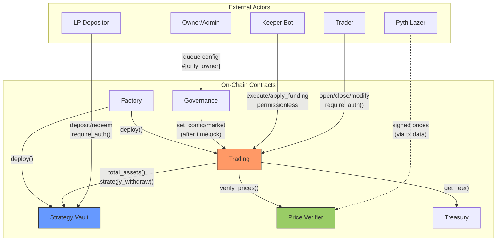
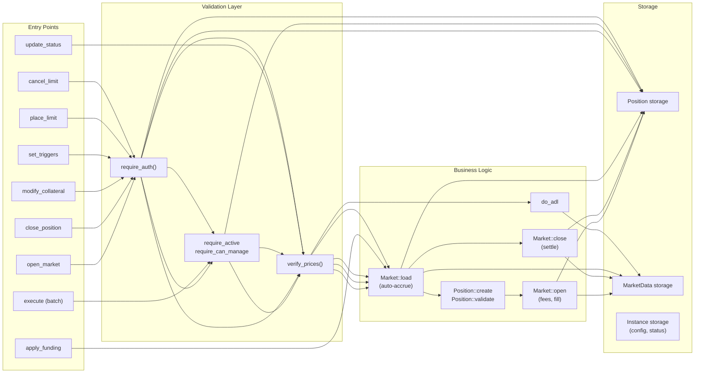
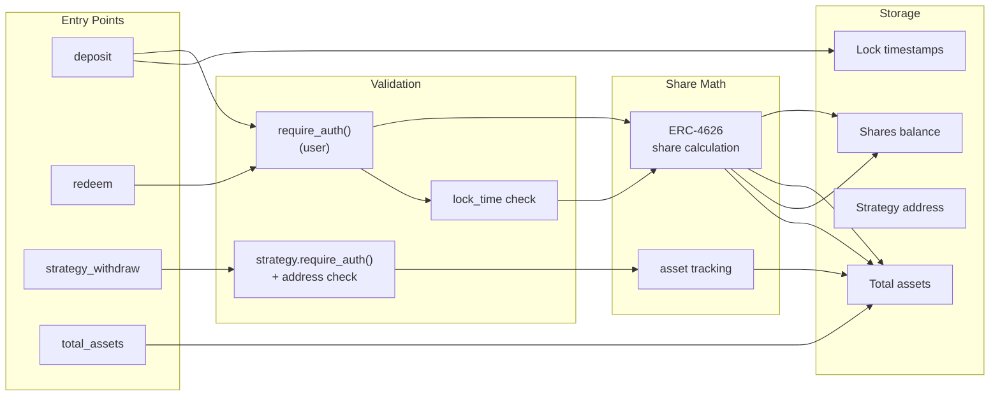
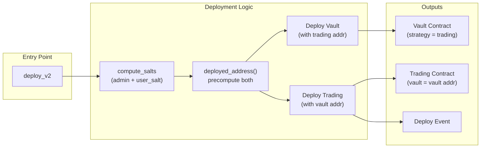
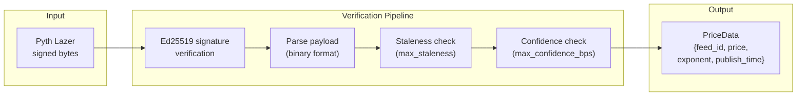

# Zenex Perpetual Futures Protocol -- STRIDE Threat Model

This document follows Stellar's four-section threat modeling framework to comprehensively identify, categorize, and address threats to the Zenex perpetual futures protocol on Soroban. The four sections correspond to the four questions: (1) What are we working on? (2) What can go wrong? (3) What are we going to do about it? (4) Did we do a good job?

**Scope:** On-chain smart contracts only. Off-chain services (keeper, relayer, backend, frontend) are modeled only at their trust boundaries with contracts.

**Contracts in scope:** Trading, Strategy Vault, Factory, Price Verifier

**Contracts out of scope:** Treasury (referenced as an external trust boundary), Account (separate repository)

---

## 1. What Are We Working On?

### 1.1 System Description

Zenex is a decentralized perpetual futures trading protocol on the Stellar blockchain (Soroban). Traders open leveraged long and short positions on price feeds (e.g., BTC/USD), backed by a shared liquidity vault that serves as the counterparty. The protocol uses a single collateral token per pool, a single oracle provider (Pyth Lazer), and all settlement happens on-chain with no off-chain matching engine.

**Core contracts:**

- **Trading** -- The primary contract managing positions, fees, funding, borrowing, and settlement. It is the main attack surface with 5 of 7 trust boundaries. Entry points include user position management (open, close, modify, triggers), keeper batch execution (fills, liquidations, stop-loss, take-profit), permissionless operations (funding accrual, status updates), and admin configuration.

- **Strategy Vault** -- An ERC-4626 compliant tokenized vault holding all collateral. LPs deposit the collateral token and receive vault shares. The trading contract (registered as the single strategy) can withdraw to settle profitable positions. Shares are subject to a configurable lock period after deposit.

- **Factory** -- Deploys trading+vault pairs atomically using deterministic address precomputation (`deployed_address()`) to resolve the circular dependency: vault needs the trading address, trading needs the vault address. The factory stores compiled WASM hashes and the treasury address at construction.

- **Price Verifier** -- Verifies Pyth Lazer signed price updates via Ed25519 signature verification, staleness checks, and confidence interval validation. Returns `PriceData` (feed_id, price, exponent, publish_time) used by the trading contract to derive `price_scalar = 10^(-exponent)` for fixed-point math.

**Key design patterns:**

- **Fixed-point math:** SCALAR_7 (10^7) for rates, fees, and ratios; SCALAR_18 (10^18) for cumulative indices (funding, borrowing, ADL). The `soroban-fixed-point-math` crate provides `fixed_mul_ceil/floor` and `fixed_div_ceil/floor` operations.
- **Index-based fee accrual:** MarketData stores cumulative funding, borrowing, and ADL indices. Positions snapshot these indices at fill time. Settlement computes accrued fees as `notional * (current_idx - snapshot_idx)`.
- **Factory deployment:** Precomputes both vault and trading addresses, deploys vault first (with trading address), then trading (with vault address). Admin address is mixed into salt derivation to prevent front-running.
- **Constructor pattern:** All contracts use `__constructor` (no separate `initialize` calls), making initialization atomic with deployment.

### 1.2 System-Level Data Flow Diagram

**Diagram notes:**
- Solid arrows represent authenticated calls (require_auth() or #[only_owner])
- Dashed arrows represent data-only flows (signed price bytes passed through transaction data)
- Trading (orange) is highlighted as the primary attack surface
- Treasury is included as an external boundary; it is out of audit scope but its trust relationship with Trading is modeled

### 1.3 Trading Contract Data Flow

**Key flows:**
- All user operations require `require_auth()` on the position owner
- `open_market` and `place_limit` require Active status; other operations require Not Frozen
- `Market::load` automatically accrues funding and borrowing indices to current timestamp
- `execute` processes a batch of Fill/StopLoss/TakeProfit/Liquidate requests sequentially
- `apply_funding` is hourly-gated and updates all market indices
- `update_status` evaluates net PnL across all markets for ADL circuit breaker

### 1.4 Vault Contract Data Flow

**Key flows:**
- Deposits mint shares via ERC-4626 math and record the deposit timestamp for lock enforcement
- Redemptions check lock period before allowing share burns
- `strategy_withdraw` is restricted to the registered strategy address (trading contract) via both `require_auth()` and stored address comparison
- `total_assets` is a read-only query used by the trading contract for utilization calculations
- `decimals_offset` parameter mitigates ERC-4626 vault inflation attacks

### 1.5 Factory Contract Data Flow

**Key flows:**
- `compute_salts` mixes the admin address into the deterministic salt, preventing front-running by other deployers
- `deployed_address()` precomputes both contract addresses before any deployment, resolving the circular dependency
- Vault is deployed first (it does not call trading at construction), then trading (which stores the vault address)
- The factory's treasury address (from `init_meta`) is passed to the trading constructor -- the deployer has no control over which treasury is used
- `is_deployed()` marks factory-deployed pools for verification

### 1.6 Price Verifier Data Flow

**Key flows:**
- Raw bytes enter from the transaction data (submitted by keeper or user)
- Ed25519 signature is verified against the stored `trusted_signer` public key using `env.crypto().ed25519_verify()`
- Binary payload is parsed according to Pyth Lazer format (magic bytes, version, feed data)
- Staleness check rejects prices where `publish_time < ledger_timestamp - max_staleness`
- Confidence check rejects prices where `confidence * 10000 > price * max_confidence_bps`
- Output PriceData is used by trading to derive `price_scalar = 10^(-exponent)` for fixed-point math
- All three threshold parameters (`trusted_signer`, `max_staleness`, `max_confidence_bps`) are owner-configurable via `#[only_owner]` functions

### 1.7 Asset Inventory

#### Financial Assets

| Asset | Type | Location | Risk if Compromised |
|-------|------|----------|---------------------|
| Collateral token balances | Fungible token | Strategy Vault (`total_assets`) | Total loss of LP-deposited liquidity backing all positions |
| Collateral held by trading | Fungible token | Trading contract token balance | Loss of unfilled limit order deposits and in-transit settlement amounts |
| Vault share tokens | Fungible token (ERC-4626) | Strategy Vault | LP ownership claims manipulated; vault drainage via share inflation |
| Protocol fee revenue | Fungible token | Treasury contract | Loss of accumulated protocol fees (bounded; no user collateral) |
| Position collateral | Per-position state | Trading: `Position.col` | Individual trader collateral stolen or misdirected |
| Trader PnL claims | Calculated at settlement | Trading contract | Fabricated profits drain vault; suppressed profits steal from traders |

#### Stateful Assets

| Asset | Type | Location | Risk if Compromised |
|-------|------|----------|---------------------|
| Open positions | Persistent storage | Trading: `Position(u32)` | Positions manipulated, deleted, or fabricated |
| Market data (indices) | Persistent storage | Trading: `MarketData(u32)` | Corrupted indices cause incorrect fee/PnL calculations for all users |
| Market configs | Persistent storage | Trading: `MarketConfig(u32)` | Exploitative parameters (zero margin, extreme fees) |
| Trading config | Instance storage | Trading contract | Global parameter manipulation affecting all markets |
| Contract status | Instance storage | Trading contract | Unauthorized freeze traps all funds; unauthorized unfreeze during crisis |
| Queued governance updates | Temporary storage | Governance contract | Stale or malicious config changes applied after timelock |
| Trusted signer pubkey | Instance storage | Price Verifier | Oracle takeover enables arbitrary price manipulation |
| Oracle thresholds | Instance storage | Price Verifier | Relaxed thresholds accept stale or low-confidence prices |
| Treasury fee rate | Instance storage | Treasury | Rate manipulation diverts fees (capped at 50%) |
| Factory init meta | Instance storage | Factory | WASM hashes determine deployed code; treasury address determines fee destination |
| Deployed pool registry | Persistent storage | Factory | False entries create phishing pools that appear factory-verified |
| Deposit lock timestamps | Persistent storage | Strategy Vault | Bypassed lock enables flash-loan style vault manipulation |

#### Privileged Credentials

| Credential | Holder | Powers | Risk if Compromised |
|------------|--------|--------|---------------------|
| Trading contract owner key | Set at construction (ideally governance) | set_config, set_market, set_status, upgrade | Total control over trading parameters and code |
| Price Verifier owner key | Set at construction | update_trusted_signer, update_max_confidence_bps, update_max_staleness | Can swap oracle signer, enabling price fabrication |
| Treasury owner key | Set at construction | set_rate, withdraw | Can drain accumulated fees and set exploitative rates |
| Governance owner key | Set at construction | queue/cancel config updates, set_status (immediate), upgrade | Can freeze/unfreeze trading, queue malicious config changes |
| Pyth Lazer trusted signer | Off-chain key stored in Price Verifier | All price data must be signed by this key | Compromise enables arbitrary price manipulation across all markets |
| Factory deployer | Any address calling `deploy()` with auth | Deploy new trading+vault pairs; deployer becomes trading owner | Can create pools with exploitative configs that appear factory-verified |

### 1.8 Actor Inventory

| Actor | Auth Method | Capabilities | Trust Level |
|-------|------------|--------------|-------------|
| Trader | `user.require_auth()` via Soroban signature verification | open_market, place_limit, close_position, cancel_limit, modify_collateral, set_triggers | Untrusted -- may attempt adversarial parameter choices |
| Keeper Bot | Permissionless (no require_auth on `execute`) | execute (batch Fill/SL/TP/Liquidate), apply_funding, update_status | Untrusted -- economically motivated, may be selective or manipulative |
| LP Depositor | `require_auth()` via OpenZeppelin vault implementation | deposit, mint, redeem, withdraw, transfer (after lock) | Untrusted -- accepts counterparty risk; may attempt vault manipulation |
| Owner/Admin | `#[only_owner]` macro (require_auth + ownership check) | set_config, set_market, set_status, upgrade, treasury set_rate/withdraw, price-verifier signer/thresholds | Trusted -- config changes timelocked via governance; status changes immediate (emergency) |
| Pyth Lazer Oracle | Ed25519 signature verification on-chain | Provides signed price data for all trading operations | Semi-trusted -- external dependency; key compromise is a known risk |
| Factory Deployer | `admin.require_auth()` on deploy() | Deploy new trading+vault pairs; deployer becomes pool owner | Trusted at deploy time -- permissionless deployment; frontend curates displayed pools |

### 1.9 Trust Boundaries

#### TB1: Trader -> Trading Contract

**What trader sends:**
- `open_market(user, feed_id, collateral, notional, is_long, tp, sl, price)` -- opens a leveraged position
- `close_position(user, position_id, price)` -- closes an existing position at current price
- `modify_collateral(user, position_id, amount, price)` -- adds or removes collateral from a position
- `set_triggers(user, position_id, tp, sl)` -- sets stop-loss and take-profit trigger prices
- `place_limit(user, feed_id, collateral, notional, is_long, tp, sl, entry_price)` -- creates a pending limit order
- `cancel_limit(user, position_id)` -- cancels an unfilled limit order
- All calls include `user.require_auth()` for Soroban signature verification

**What could go wrong in transit:**
- Transaction replay: prevented by Soroban's built-in nonce mechanism
- Front-running: possible via Stellar fee bumping -- attacker sees pending open_market and front-runs with own position to move the price. Mitigated by oracle price being verified (not affected by on-chain ordering) and by the impact fee mechanism
- Stale price submission: user submits an old signed price hoping for favorable entry -- rejected by staleness check in price verifier

**If trader is malicious:**
- Self-harm only: traders can only affect their own positions (require_auth enforces position ownership)
- Exception: large positions can trigger ADL on other users via `update_status` -- this is by design (ADL protects the vault)
- Adversarial parameters: extreme leverage, minimum collateral, maximum notional -- all bounded by config validation (margin requirement, notional bounds, utilization caps)
- Smart contract users: Soroban's `require_auth()` can be satisfied by contracts implementing `__check_auth()` with auto-approve patterns, enabling automated trading bots as position owners. This is by design.

**If trader is unavailable:**
- No impact on protocol -- the trader simply does not trade
- Open positions continue accruing fees (funding, borrowing) -- if a position becomes under-collateralized, keepers will liquidate it
- Unfilled limit orders remain pending until cancelled or filled

**Contract verification:**
- `require_auth()` on user address for all position operations
- Position ownership check from storage for subsequent operations (close, modify, cancel, triggers) -- the caller cannot substitute a different owner address
- Config validation: notional in [min, max], leverage <= 1/init_margin, TP > entry (longs) or TP < entry (shorts)
- Status guards: require_active for opens, require_can_manage for modifications

**Trust assumptions:**
- Trader's private key is not compromised
- Trader understands the risk of on-chain position transparency (positions, SL/TP, limit orders are publicly visible)

---

#### TB2: Keeper -> Trading Contract

**What keeper sends:**
- `execute(caller: Address, requests: Vec<ExecuteRequest>, price: Bytes)` -- batch of Fill/StopLoss/TakeProfit/Liquidate actions
- `caller` = fee destination address (not authenticated via require_auth)
- `requests` = ordered batch of position actions with trigger conditions
- `price` = Pyth Lazer signed price blob for verification
- `apply_funding()` -- triggers hourly funding and borrowing index accrual across all markets
- `update_status(price: Bytes)` -- evaluates net PnL for ADL circuit breaker

**What could go wrong in transit:**
- Price data could be stale (within max_staleness but significantly different from current market)
- Price data could be for the wrong feed_id (verified by price verifier against requested feeds)
- Batch could contain conflicting requests (fill + liquidate same position in one batch)

**If keeper is malicious:**
- Selective liquidation: ignores some eligible positions to protect allies -- mitigated by permissionless access (anyone can be a keeper)
- Timing manipulation: waits for favorable price before submitting liquidation -- limited by keeper competition and price staleness window
- Batch ordering: sequences requests to change market state mid-batch (e.g., large fill before marginal liquidation) -- each request validated against its own conditions
- Fee routing: sets `caller` to any address (low impact -- fees flow TO the address, not FROM it)

**If keeper is unavailable:**
- Liquidations do not execute -- under-collateralized positions bleed the vault
- SL/TP orders do not trigger -- users miss their protection levels
- Limit orders do not fill -- users miss entry opportunities
- `apply_funding` not called -- rate indices become stale (but accrue correctly on next interaction via Market::load auto-accrue)

**Contract verification:**
- Each request type has its own trigger condition verified against the verified price
- `require_can_manage()` -- status must not be Frozen
- Price verified via PriceVerifier cross-contract call (signature, staleness, confidence)
- No caller authentication on execute (permissionless by design)

**Trust assumptions:**
- At least one keeper is economically motivated to liquidate (caller fee incentive)
- Keepers submit reasonably fresh prices (within max_staleness)
- Keeper liveness is an operational concern, not a contract guarantee

---

#### TB3: Trading -> Price Verifier

**What trading sends:**
- `verify_prices(update_data: Bytes)` -- cross-contract call passing raw Pyth Lazer signed bytes
- Called during: open_market, close_position, execute (all types), update_status, modify_collateral

**What could go wrong in transit:**
- None -- this is an intra-Soroban cross-contract call. Execution is atomic within the same transaction. Data cannot be modified between the Trading and Price Verifier contracts.

**If price verifier is malicious (compromised contract or signer):**
- Returns fabricated prices -- enables arbitrary PnL manipulation, vault drainage
- Returns wrong exponents -- causes price_scalar miscalculation, affecting all position math
- Returns stale timestamps that pass validation -- positions opened/closed at outdated prices
- Accepts signatures from unauthorized keys -- any attacker can fabricate price data

**If price verifier is unavailable:**
- `verify_prices()` panics -- the calling transaction reverts entirely
- All position operations requiring price verification are blocked (open, close, execute, update_status, modify_collateral)
- Only price-independent operations work: place_limit, cancel_limit, set_triggers, apply_funding, admin functions

**Contract verification:**
- Ed25519 signature verification against stored `trusted_signer` public key
- Staleness check: `publish_time >= ledger_timestamp - max_staleness`
- Confidence check: `confidence * 10000 <= price * max_confidence_bps`
- Feed ID matching against requested feeds

**Trust assumptions:**
- The Ed25519 trusted signer key (Pyth Lazer) is not compromised
- Pyth Lazer service is available and producing timely, accurate prices
- The price verifier contract code is correct (deployed via factory with audited WASM hash)

---

#### TB4: Trading -> Vault (Strategy Vault)

**What trading sends:**
- `strategy_withdraw(strategy: Address, amount: i128)` -- withdraws collateral to settle profitable positions
- `total_assets()` -- queries vault TVL for utilization calculations

**What could go wrong in transit:**
- None -- intra-Soroban cross-contract call, atomic execution within the same transaction

**If vault is malicious (compromised contract):**
- Returns inflated `total_assets()` -- suppresses utilization calculations, raises ADL thresholds, allows excessive position sizes, lowers borrowing rates
- Returns deflated `total_assets()` -- artificially triggers utilization limits, blocks legitimate opens, inflates borrowing rates
- Refuses `strategy_withdraw` -- profitable position closes revert; users with winning positions are trapped
- Allows unauthorized withdrawals -- vault drained by non-strategy callers

**If vault is unavailable:**
- `total_assets()` call fails -- trading operations that load market context revert (open, close, execute)
- `strategy_withdraw` fails -- profitable position closes revert
- Protocol is effectively frozen for position operations

**Contract verification:**
- Trading is registered as the vault's strategy address at vault construction (immutable, no setter)
- `strategy.require_auth()` on strategy_withdraw ensures only the registered strategy can withdraw
- Stored strategy address check: `get_strategy(env) == strategy`

**Trust assumptions:**
- Vault contract code is correct (deployed atomically via factory with audited WASM hash)
- Single strategy model -- only one trading contract per vault
- ERC-4626 share math correctly tracks assets and shares

---

#### TB5: Trading -> Treasury

**What trading sends:**
- `get_fee(revenue: i128)` -- calculates the protocol fee split from trading fees

**What could go wrong in transit:**
- None -- intra-Soroban cross-contract call, atomic execution

**If treasury is malicious (compromised contract or owner):**
- Returns inflated fee percentage -- capped at 50% by `MAX_TREASURY_RATE` validation in `set_rate`
- Returns deflated fee (zero) -- protocol earns no fees but users are not harmed
- Worst case at maximum rate: 50% of trading fees diverted to treasury (remaining 50%+ goes to vault and caller)

**If treasury is unavailable:**
- `get_fee()` call fails -- position close/settlement operations revert
- Positions cannot be closed until treasury is accessible

**Contract verification:**
- Treasury rate capped in treasury config validation (`rate <= SCALAR_7 / 2`, i.e., 50%)
- Treasury address set at trading constructor (immutable, no setter)

**Trust assumptions:**
- Treasury owner has not set an adversarial rate within the 50% cap
- Treasury contract is available for fee queries during settlement

---

#### TB6: Governance -> Trading Contract

**What governance sends:**
- `set_config(config: TradingConfig)` -- updates global trading parameters (after timelock delay)
- `set_market(feed_id, config: MarketConfig)` -- adds or updates market configuration (after timelock delay)
- `set_status(status: ContractStatus)` -- changes contract status (immediate, no timelock)

**What could go wrong in transit:**
- None -- intra-Soroban cross-contract call, atomic execution

**If governance/owner is malicious:**
- Sets extreme parameters: zero init_margin (allowing infinite leverage), 100% fees (draining collateral on every trade), disables markets, sets exploitative borrowing rates
- Mitigated by config validation bounds: all parameters have upper/lower limits enforced in `require_valid_config` and `require_valid_market_config`
- Freezes the contract via `set_status(Frozen)` -- traps all positions and funds (immediate, no timelock)
- Queues malicious config, freezes contract, waits for timelock, unfreezes and applies -- users have no exit window between unfreeze and config application

**If governance is unavailable:**
- Config cannot be updated -- existing configuration remains in effect (fail-safe)
- Status cannot be changed by admin -- permissionless `update_status` still works for ADL
- No degradation of trading operations

**Contract verification:**
- `#[only_owner]` on all governance functions (`queue_set_config`, `cancel_set_config`, `queue_set_market`, `cancel_set_market`, `set_status`)
- Timelock delay: queued changes must wait `LEDGER_THRESHOLD_TEMP` (100-day TTL) before execution
- Config validation bounds enforced when changes are applied
- `set_status` cannot set `OnIce` (only `update_status` can, via permissionless threshold check)
- Permissionless execution after timelock: `set_config()` and `set_market()` on governance can be triggered by anyone after the delay expires

**Trust assumptions:**
- Owner key is not compromised
- Timelock delay provides sufficient exit window for users to react to queued changes
- Governance transparency (queued changes are publicly visible) enables community monitoring

**Note:** This boundary subsumes TB8 (Owner Key Management) from the prior security analysis. Owner key security is an operational concern that affects all boundaries equally -- it is documented here as a cross-cutting trust assumption rather than a separate boundary.

---

#### TB7: LP -> Vault

**What LP sends:**
- `deposit(amount: i128)` -- deposits collateral tokens and receives vault shares via `require_auth()`
- `redeem(shares: i128)` -- burns vault shares and receives proportional collateral tokens via `require_auth()`
- `transfer(from, to, amount)` -- transfers vault shares (blocked during lock period)

**What could go wrong in transit:**
- Front-running deposits before large losses: attacker sees incoming large trader loss, front-runs deposit to dilute existing LPs' share of the loss. Mitigated by deposit lock period and by the fact that losses reduce `total_assets`, making shares cheaper (attacker buys at the reduced price).
- Front-running redemptions before large wins: attacker sees incoming trader profit, front-runs redemption to exit before the vault pays out. Mitigated by deposit lock period.

**If LP is malicious:**
- Vault inflation attack: first depositor donates tokens directly to vault (not through `deposit`), inflating `total_assets()` without minting shares. Subsequent depositors receive fewer shares per token. Mitigated by `decimals_offset` in ERC-4626 implementation (adds virtual shares/assets).
- Deposit/redeem cycling to manipulate utilization: rapid deposits increase total_assets (lowering utilization), enabling larger positions; rapid redemptions decrease total_assets (raising utilization). Mitigated by deposit lock period and by utilization being checked on each position operation.
- Share price manipulation via large deposits followed by profitable trades: LP deposits, then trades profitably against the vault, then redeems. The LP profits from both the trade and the share price increase. This is a rational economic strategy, not an exploit -- the LP bears full counterparty risk during the period.

**If LP is unavailable:**
- No new liquidity enters the vault -- existing vault balance continues to serve open positions
- No impact on protocol operations

**Contract verification:**
- `require_auth()` on LP address for all deposit and redemption operations
- Lock period enforcement: `now >= last_deposit_time + lock_time` checked before redemption or transfer
- Share math follows ERC-4626 standard (OpenZeppelin `stellar-tokens` implementation)
- `decimals_offset` provides inflation attack mitigation

**Trust assumptions:**
- LPs accept the risk of strategy losses (counterparty to all trader positions)
- LPs understand that vault share value fluctuates with trader PnL
- Lock period is set appropriately at deployment to prevent front-running

---

## 2. What Can Go Wrong?

_[Section 2 content to be added -- STRIDE threat catalog]_

## 3. What Are We Going to Do About It?

_[Section 3 content to be added -- mitigations and remediations for each identified threat]_

## 4. Did We Do a Good Job?

_[Section 4 content to be added -- retrospective evaluation of threat model completeness]_
