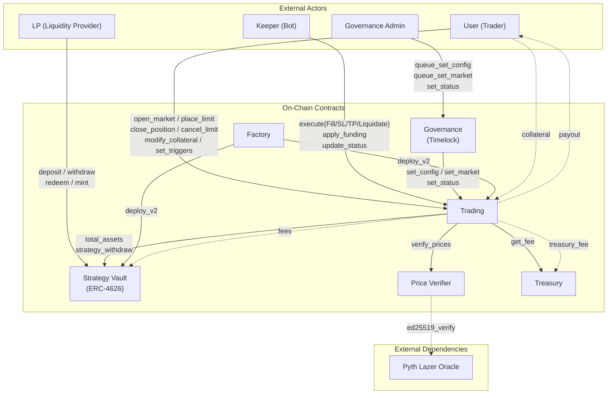
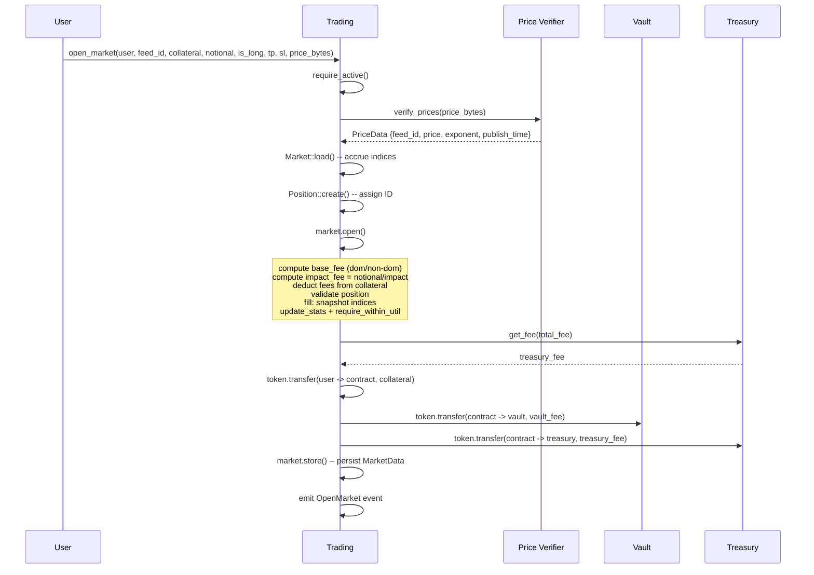
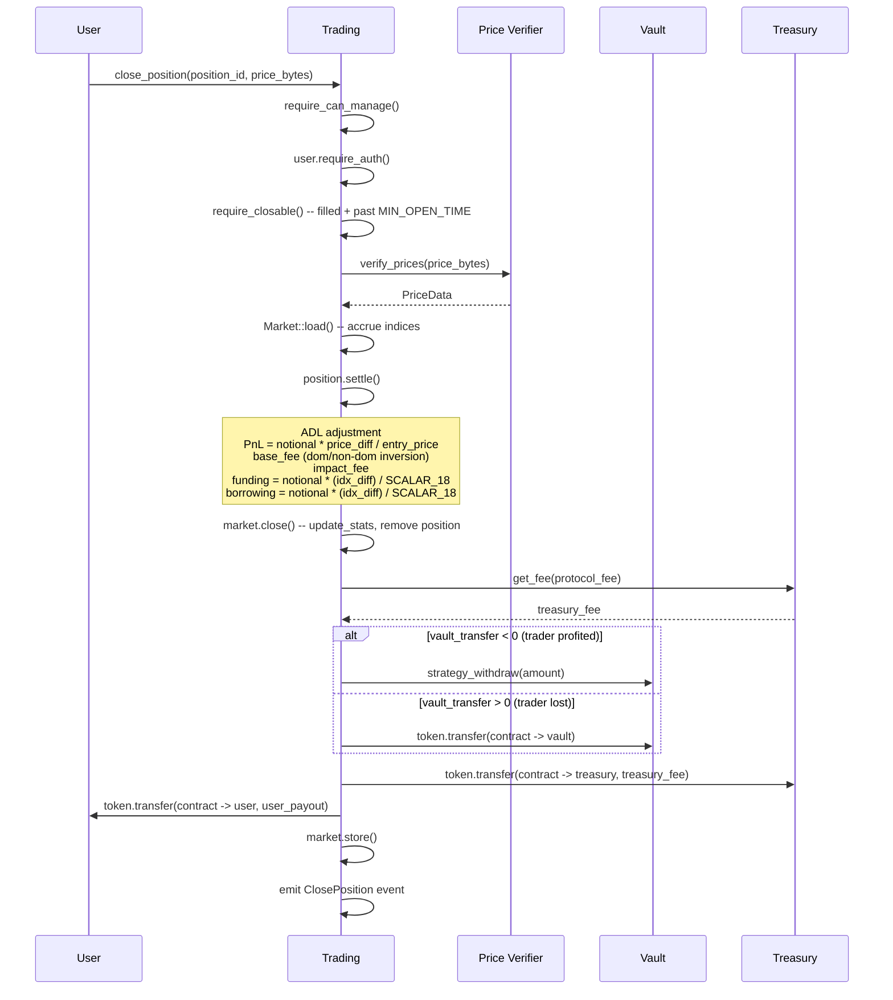
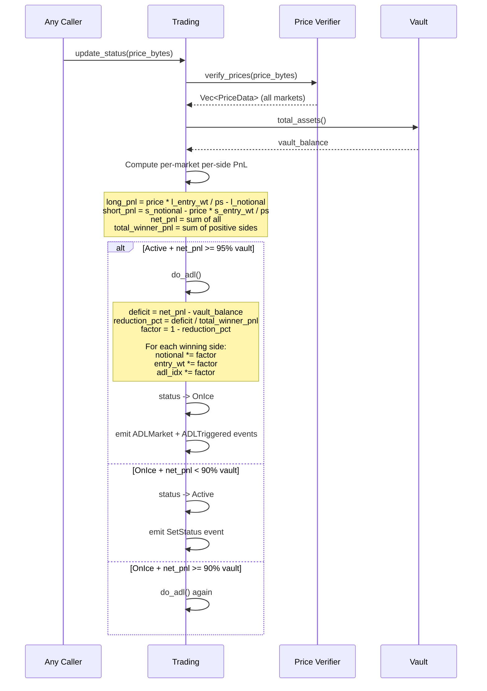

# Zenex Contracts Architecture

## System Overview

## Open Position Flow

## Close Position Flow

## ADL Flow

## Data Model

### Key Types

**TradingConfig** (global, instance storage):
| Field | Type | Unit | Purpose |
|-------|------|------|---------|
| `caller_rate` | i128 | SCALAR_7 | Keeper share of trading fees |
| `min_notional` | i128 | token_decimals | Minimum position size |
| `max_notional` | i128 | token_decimals | Maximum position size |
| `fee_dom` | i128 | SCALAR_7 | Dominant side fee rate |
| `fee_non_dom` | i128 | SCALAR_7 | Non-dominant side fee rate |
| `max_util` | i128 | SCALAR_7 | Global utilization cap |
| `r_funding` | i128 | SCALAR_18 | Base hourly funding rate |
| `r_base` | i128 | SCALAR_18 | Base hourly borrowing rate |
| `r_var` | i128 | SCALAR_7 | Borrowing curve multiplier |

**MarketConfig** (per-market, persistent storage):
| Field | Type | Unit | Purpose |
|-------|------|------|---------|
| `enabled` | bool | -- | Market accepting new positions |
| `max_util` | i128 | SCALAR_7 | Per-market utilization cap |
| `r_borrow` | i128 | SCALAR_7 | Borrowing weight (1e7 = 1x) |
| `margin` | i128 | SCALAR_7 | Initial margin requirement |
| `liq_fee` | i128 | SCALAR_7 | Liquidation threshold/fee |
| `impact` | i128 | SCALAR_7 | Impact fee divisor |

**MarketData** (per-market mutable state, persistent storage):
| Field | Type | Unit | Purpose |
|-------|------|------|---------|
| `l_notional` / `s_notional` | i128 | token_decimals | Total open interest per side |
| `l_fund_idx` / `s_fund_idx` | i128 | SCALAR_18 | Cumulative funding indices |
| `l_borr_idx` / `s_borr_idx` | i128 | SCALAR_18 | Cumulative borrowing indices |
| `l_entry_wt` / `s_entry_wt` | i128 | price_scalar | Sum(notional/entry_price) per side |
| `fund_rate` | i128 | SCALAR_18 | Current signed funding rate |
| `last_update` | u64 | seconds | Last accrual timestamp |
| `l_adl_idx` / `s_adl_idx` | i128 | SCALAR_18 | ADL reduction indices (start at 1.0) |

**Position** (per-position, persistent storage):
| Field | Type | Unit | Purpose |
|-------|------|------|---------|
| `user` | Address | -- | Position owner |
| `filled` | bool | -- | false = pending limit order |
| `feed` | u32 | -- | Market feed ID |
| `long` | bool | -- | Long or short |
| `sl` / `tp` | i128 | price units | Stop loss / take profit (0 = not set) |
| `entry_price` | i128 | price units | Fill price |
| `col` | i128 | token_decimals | Collateral |
| `notional` | i128 | token_decimals | Position size |
| `fund_idx` | i128 | SCALAR_18 | Funding index at fill |
| `borr_idx` | i128 | SCALAR_18 | Borrowing index at fill |
| `adl_idx` | i128 | SCALAR_18 | ADL index at fill |
| `created_at` | u64 | seconds | Creation timestamp |

## Storage Architecture

### Instance Storage (Hot Data)

Bumped on every transaction. TTL: 30-day threshold, 31-day bump.

| Key | Type | Access Pattern |
|-----|------|---------------|
| `Status` | u32 | Every tx (status checks) |
| `Config` | TradingConfig | Every position open/close |
| `Vault` | Address | Every position open/close |
| `Token` | Address | Every token transfer |
| `PriceVerifier` | Address | Every price verification |
| `Treasury` | Address | Every fee calculation |
| `PositionCounter` | u32 | Every position creation |
| `TotalNotional` | i128 | Every position open/close |
| `LastFundingUpdate` | u64 | Every apply_funding call |

Source: `trading/src/storage.rs` lines 12-16.

### Persistent Storage (Per-Entity)

**Market storage** (config + data, touched frequently). TTL: 45-day threshold, 52-day bump.

| Key Pattern | Type | Notes |
|-------------|------|-------|
| `Markets` | Vec<u32> | List of all market feed IDs |
| `MarketConfig(feed_id)` | MarketConfig | Per-market parameters |
| `MarketData(feed_id)` | MarketData | Per-market mutable state + indices |

**Position storage** (short-lived). TTL: 14-day threshold, 21-day bump.

| Key Pattern | Type | Notes |
|-------------|------|-------|
| `Position(id)` | Position | Individual position state |
| `UserPositions(address)` | Vec<u32> | User's position ID list (max 50) |

Source: `trading/src/storage.rs` lines 18-24.

### Governance Temporary Storage

Queued config/market updates use temporary storage. TTL: 100-day threshold, 120-day bump.

Source: `governance/src/lib.rs` lines 49-51.

### Factory Persistent Storage

Deployed pool tracking. TTL: 100-day threshold, 120-day bump.

Source: `factory/src/storage.rs` lines 10-11.

## Layer Architecture

| Layer | Purpose | Key Files |
|-------|---------|-----------|
| **Contract** | Entry points, auth, trait impl | `trading/src/contract.rs`, `factory/src/lib.rs`, `price-verifier/src/lib.rs`, `strategy-vault/src/contract.rs`, `treasury/src/lib.rs`, `governance/src/lib.rs` |
| **Business Logic** | Position operations, fee calculations | `trading/src/trading/actions.rs`, `trading/src/trading/execute.rs`, `trading/src/trading/config.rs`, `trading/src/trading/adl.rs` |
| **Domain Models** | Market and position behavior | `trading/src/trading/market.rs`, `trading/src/trading/position.rs`, `trading/src/trading/rates.rs` |
| **Storage** | Ledger persistence, TTL management | `trading/src/storage.rs`, `strategy-vault/src/storage.rs`, `treasury/src/storage.rs` |
| **Dependencies** | Cross-contract client interfaces | `trading/src/dependencies/vault.rs`, `trading/src/dependencies/price_verifier.rs`, `trading/src/dependencies/treasury.rs` |
| **Types** | Domain types, enums | `trading/src/types.rs`, `trading/src/errors.rs` |
| **Validation** | Input validation, status guards | `trading/src/validation.rs` |
| **Events** | Off-chain indexing | `trading/src/events.rs`, `factory/src/events.rs` |

## Contract Entry Points

### Trading Contract

| Entry Point | Access | Parameters | Returns |
|-------------|--------|-----------|---------|
| `set_config` | Owner only | `config: TradingConfig` | -- |
| `set_market` | Owner only | `feed_id: u32, config: MarketConfig` | -- |
| `del_market` | Owner only | `feed_id: u32` | -- |
| `set_status` | Owner only | `status: u32` | -- |
| `update_status` | Permissionless | `price: Bytes` | -- |
| `place_limit` | User auth | `user, feed_id, collateral, notional, is_long, entry_price, tp, sl` | `u32` (position ID) |
| `open_market` | User auth | `user, feed_id, collateral, notional, is_long, tp, sl, price` | `u32` (position ID) |
| `cancel_limit` | User auth | `position_id: u32` | `i128` (refund) |
| `close_position` | User auth | `position_id: u32, price: Bytes` | `i128` (payout) |
| `modify_collateral` | User auth | `position_id: u32, new_collateral: i128, price: Bytes` | -- |
| `set_triggers` | User auth | `position_id: u32, tp: i128, sl: i128` | -- |
| `execute` | Permissionless | `caller: Address, requests: Vec<ExecuteRequest>, price: Bytes` | -- |
| `apply_funding` | Permissionless | -- | -- |
| `get_position` | Public | `position_id: u32` | `Position` |
| `get_user_positions` | Public | `user: Address` | `Vec<u32>` |
| `get_market_config` | Public | `feed_id: u32` | `MarketConfig` |
| `get_market_data` | Public | `feed_id: u32` | `MarketData` |
| `get_markets` | Public | -- | `Vec<u32>` |
| `get_config` | Public | -- | `TradingConfig` |
| `get_status` | Public | -- | `u32` |
| `get_vault` | Public | -- | `Address` |
| `get_price_verifier` | Public | -- | `Address` |
| `get_treasury` | Public | -- | `Address` |
| `get_token` | Public | -- | `Address` |

### Strategy Vault

| Entry Point | Access | Parameters | Returns |
|-------------|--------|-----------|---------|
| `deposit` | Operator auth | `assets, receiver, from, operator` | `i128` (shares) |
| `mint` | Operator auth | `shares, receiver, from, operator` | `i128` (assets) |
| `withdraw` | Owner auth + lock expired | `assets, receiver, owner, operator` | `i128` (shares) |
| `redeem` | Owner auth + lock expired | `shares, receiver, owner, operator` | `i128` (assets) |
| `strategy_withdraw` | Strategy auth | `strategy, amount` | -- |
| `lock_time` | Public | -- | `u64` |
| `lock_duration` | Public | `user: Address` | `u64` |
| `transfer` | From auth + lock expired | `from, to, amount` | -- |
| `transfer_from` | Spender auth + lock expired | `spender, from, to, amount` | -- |

### Price Verifier

| Entry Point | Access | Parameters | Returns |
|-------------|--------|-----------|---------|
| `verify_price` | Public | `update_data: Bytes` | `PriceData` |
| `verify_prices` | Public | `update_data: Bytes` | `Vec<PriceData>` |
| `update_trusted_signer` | Owner only | `new_signer: BytesN<32>` | -- |
| `update_max_confidence_bps` | Owner only | `max_confidence_bps: u32` | -- |
| `update_max_staleness` | Owner only | `max_staleness: u64` | -- |
| `max_confidence_bps` | Public | -- | `u32` |
| `max_staleness` | Public | -- | `u64` |

### Factory

| Entry Point | Access | Parameters | Returns |
|-------------|--------|-----------|---------|
| `deploy` | Admin auth | `admin, salt, token, price_verifier, config, vault_name, vault_symbol, decimals_offset, lock_time` | `Address` (trading) |
| `is_deployed` | Public | `trading: Address` | `bool` |

### Governance (Timelock)

| Entry Point | Access | Parameters | Returns |
|-------------|--------|-----------|---------|
| `queue_set_config` | Owner only | `config: TradingConfig` | -- |
| `cancel_set_config` | Owner only | -- | -- |
| `set_config` | Permissionless (after delay) | -- | -- |
| `queue_set_market` | Owner only | `feed_id: u32, config: MarketConfig` | `u32` (nonce) |
| `cancel_set_market` | Owner only | `nonce: u32` | -- |
| `set_market` | Permissionless (after delay) | `nonce: u32` | -- |
| `set_status` | Owner only | `status: u32` | -- |
| `get_trading` | Public | -- | `Address` |
| `get_delay` | Public | -- | `u64` |
| `get_queued_config` | Public | -- | `QueuedConfig` |
| `get_queued_market` | Public | `nonce: u32` | `QueuedMarket` |

### Treasury

| Entry Point | Access | Parameters | Returns |
|-------------|--------|-----------|---------|
| `get_rate` | Public | -- | `i128` |
| `get_fee` | Public | `total_fee: i128` | `i128` |
| `set_rate` | Owner only | `rate: i128` | -- |
| `withdraw` | Owner only | `token: Address, to: Address, amount: i128` | -- |

## Fee Implementation Notes

### Where Each Fee Is Computed

| Fee Type | Computation File | Settlement File | Scale |
|----------|-----------------|----------------|-------|
| Base fee (open) | `trading/src/trading/market.rs` line 84-88 | -- | SCALAR_7 |
| Base fee (close) | -- | `trading/src/trading/position.rs` lines 168-172 | SCALAR_7 |
| Impact fee | `market.rs` line 89 | `position.rs` line 173 | SCALAR_7 |
| Funding rate | `trading/src/trading/rates.rs` -- `calc_funding_rate()` | -- | SCALAR_18 |
| Funding index | `market.rs` -- `accrue()` lines 194-221 | -- | SCALAR_18 |
| Funding fee | -- | `position.rs` line 175 | SCALAR_18 -> token |
| Borrowing rate | `rates.rs` -- `calc_borrowing_rate()` | -- | SCALAR_18 |
| Borrowing index | `market.rs` -- `accrue()` lines 173-191 | -- | SCALAR_18 |
| Borrowing fee | -- | `position.rs` line 176 | SCALAR_18 -> token |
| Treasury fee | `treasury/src/lib.rs` -- `get_fee()` | -- | SCALAR_7 |
| Caller fee | `execute.rs` lines 116-117, 155-156 | -- | SCALAR_7 |

### SCALAR_7 vs SCALAR_18 Decision Points

- **SCALAR_7**: Rates visible to users (fee rates, utilization, margin), config parameters, token amounts
- **SCALAR_18**: Cumulative indices that accumulate tiny per-second deltas over long periods. Higher precision prevents truncation errors from compounding over time.
- **Transition point**: When computing a per-position fee from an index diff, the result transitions from SCALAR_18 (index space) to token_decimals (fee amount) via `fixed_mul` with SCALAR_18 as the scalar.

### Index Mechanics

| Index | Per-Market Fields | Per-Position Snapshot | Accrues When | Pays When |
|-------|-------------------|----------------------|-------------|-----------|
| `fund_idx` | `l_fund_idx`, `s_fund_idx` | `fund_idx` | Every market operation + apply_funding | Settlement |
| `borr_idx` | `l_borr_idx`, `s_borr_idx` | `borr_idx` | Every market operation | Settlement |
| `adl_idx` | `l_adl_idx`, `s_adl_idx` | `adl_idx` | ADL event only | Settlement (scales notional) |

### Rounding Conventions

- **Fees**: ceil (collect more) -- `fixed_mul_ceil` / `fixed_div_ceil`
- **PnL**: floor (pay less) -- `fixed_mul_floor` / `fixed_div_floor`
- **Funding receive**: floor (distribute less than collected)
- **ADL reduction**: floor (reduce more aggressively)

This asymmetry ensures the vault never pays out more than it should.

### Dominant Side Detection

The `is_dominant()` method in `MarketData` (source: `market.rs` lines 153-159) checks if a given side PLUS any new notional being added exceeds the other side. This is used:
- **At open**: checks if the new position makes its side dominant (with `+notional`)
- **At close/settle**: checks if removing the position leaves the side dominant (with `-notional`)

The sign of `extra` flips the fee tier: opening on dominant side pays more; closing from dominant side pays less (rebalancing reward).
